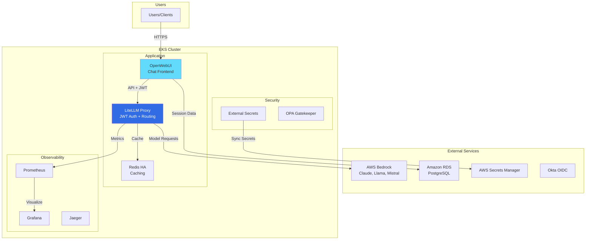

# LiteLLM + OpenWebUI EKS Deployment

**Production-ready AI/LLM infrastructure on Amazon EKS** with comprehensive observability, security, and authentication.

## Features

- 🔐 **JWT Authentication** - Client-agnostic auth via Okta OIDC ([Setup Guide](docs/JWT_AUTHENTICATION_SETUP.md))
- 🤖 **Multi-Model Support** - Claude, Llama, Mistral via AWS Bedrock
- 📊 **Full Observability** - Prometheus, Grafana, Jaeger distributed tracing
- 🔒 **Security First** - OPA Gatekeeper policies, IRSA, encrypted secrets
- ⚡ **High Availability** - Redis HA, multi-replica deployments
- 🛠️ **Extensible** - Support for Model Context Protocol (MCP) servers

## Quick Links

| Guide | Description |
|-------|-------------|
| 🚀 [Quick Start](#quick-start) | Get started in 20-35 minutes |
| 📖 [Deployment Guide](docs/DEPLOYMENT_GUIDE.md) | Complete step-by-step walkthrough |
| 🔐 [JWT Setup](docs/JWT_AUTHENTICATION_SETUP.md) | Configure Okta OIDC authentication |
| 📦 [ECR Setup](docs/ECR_SETUP.md) | Container registry configuration |
| 🤖 [MCP Deployment](docs/MCP_DEPLOYMENT.md) | Deploy Model Context Protocol servers |
| 🏗️ [MCP Operator](docs/MCP_OPERATOR_ARCHITECTURE.md) | Kubernetes operator for MCP servers |

---

## Architecture



## Components

| Component | Version | Purpose |
|-----------|---------|---------|
| **LiteLLM** | v1.80.5-stable | API gateway to AWS Bedrock models |
| **OpenWebUI** | latest | Chat frontend with Okta authentication |
| **Redis HA** | 7.4-alpine | Caching & rate limiting |
| **Prometheus/Grafana** | - | Metrics collection & visualization |
| **Jaeger** | 1.53 | Distributed tracing |
| **External Secrets** | - | AWS Secrets Manager integration |
| **OPA Gatekeeper** | - | Policy enforcement |

---

## Prerequisites

### AWS Account Setup
- AWS account with appropriate permissions
- AWS CLI v2 configured (`aws configure`)
- EKS cluster permissions

### Local Tools
```bash
# macOS
brew install awscli kubectl helm

# Verify installations
aws --version      # AWS CLI 2.x
kubectl version    # v1.28+
helm version       # v3.0+
```

### Infrastructure Deployment
Choose **one** of these options:

| Option | Time | Best For | Guide |
|--------|------|----------|-------|
| **eksctl** | 15-20 min | Dev/Testing | [eksctl/README.md](eksctl/README.md) |
| **Terraform** | 25-35 min | Production | [terraform/README.md](terraform/README.md) |

📖 **See [Deployment Comparison](docs/DEPLOYMENT_GUIDE.md#deployment-comparison)** for detailed feature comparison.

---

## Quick Start

### 1. Deploy Infrastructure

```bash
# Set environment variables
export AWS_REGION=us-east-1
export EKS_CLUSTER_NAME=litellm-eks
export AWS_ACCOUNT_ID=$(aws sts get-caller-identity --query Account --output text)

# Choose deployment method
cd scripts
./deploy.sh infrastructure
# You'll be prompted to choose: [T]erraform or [E]ksctl
```

### 2. Configure kubectl

```bash
aws eks update-kubeconfig --name $EKS_CLUSTER_NAME --region $AWS_REGION
kubectl cluster-info  # Verify connection
```

### 3. Create Required Secrets

Create Okta secrets in AWS Secrets Manager ([detailed guide](docs/JWT_AUTHENTICATION_SETUP.md)):

```bash
# LiteLLM: JWT public key URL
aws secretsmanager create-secret \
  --name litellm/jwt-public-key-url \
  --secret-string "https://<your-okta-domain>/oauth2/default/v1/keys" \
  --region $AWS_REGION

# OpenWebUI: Session encryption, Okta client ID/secret, admin email
# See JWT_AUTHENTICATION_SETUP.md for complete secret creation steps
```

**Note:** Database URL secret should already exist from Terraform/eksctl setup.

### 4. Deploy Applications

```bash
cd scripts
./deploy.sh all
```

This deploys:
- ✅ External Secrets Operator
- ✅ OPA Gatekeeper + policies
- ✅ Prometheus/Grafana monitoring
- ✅ Jaeger distributed tracing
- ✅ Redis HA cluster
- ✅ LiteLLM proxy with JWT authentication
- ✅ OpenWebUI with Okta OIDC

### 5. Verify Deployment

```bash
kubectl get pods -A | grep -E 'litellm|open-webui|monitoring|redis'
kubectl get externalsecret -A  # Verify secrets synced
```

### 6. Access Applications

**Option A: From bastion host**
```bash
./scripts/setup-bastion.sh create
./scripts/setup-bastion.sh connect

# Inside bastion:
llm-ui          # OpenWebUI → http://localhost:8080
llm-grafana     # Grafana → http://localhost:3000
```

**Option B: Port-forward from local machine**
```bash
# OpenWebUI
kubectl port-forward -n open-webui svc/open-webui 8080:80

# Grafana (default: admin / prom-operator)
kubectl port-forward -n monitoring svc/kube-prometheus-grafana 3000:80
```

---

## Directory Structure

```
eks-deploy/
├── docs/                            # Documentation
│   ├── DEPLOYMENT_GUIDE.md          # Complete deployment walkthrough
│   ├── JWT_AUTHENTICATION_SETUP.md  # Okta/JWT configuration
│   ├── ECR_SETUP.md                 # Container registry setup
│   ├── MCP_DEPLOYMENT.md            # Model Context Protocol servers
│   └── MCP_OPERATOR_ARCHITECTURE.md # MCP Kubernetes operator design
├── eksctl/                          # eksctl cluster configuration
│   ├── cluster.yaml                 # EKS cluster definition
│   └── README.md                    # eksctl deployment guide
├── terraform/                       # Terraform infrastructure
│   ├── main.tf                      # Main configuration
│   ├── modules/                     # Reusable modules
│   └── README.md                    # Terraform deployment guide
├── helm-values/                     # Helm chart configurations
│   ├── litellm-values.yaml          # LiteLLM proxy
│   ├── openwebui-values.yaml        # OpenWebUI frontend
│   ├── redis-values.yaml            # Redis HA
│   ├── kube-prometheus-stack-values.yaml
│   ├── jaeger-values.yaml
│   ├── external-secrets-values.yaml
│   └── gatekeeper-values.yaml
├── manifests/                       # Kubernetes manifests
│   ├── namespaces.yaml
│   ├── cluster-secret-store.yaml
│   ├── litellm-external-secret.yaml
│   ├── openwebui-external-secret.yaml
│   └── opa-policies/                # OPA Gatekeeper policies
├── scripts/                         # Deployment automation
│   ├── deploy.sh                    # Main deployment script
│   ├── setup-bastion.sh             # Bastion EC2 setup
│   └── README.md                    # Script usage guide
├── iam/                             # IAM policies for IRSA
│   ├── litellm-bedrock-policy.json
│   ├── external-secrets-policy.json
│   └── trust-policy-template.json
├── grafana_dashboards/
│   └── litellm-prometheus.json
└── security/
    └── ARCHITECTURE.md              # Security architecture
```

---

## Deployment Options

The `deploy.sh` script supports granular deployment:

```bash
# Full deployment
./deploy.sh all

# Infrastructure only
./deploy.sh terraform    # or: ./deploy.sh eksctl

# Individual components
./deploy.sh irsa                 # Create IAM roles
./deploy.sh secrets              # Create AWS secrets
./deploy.sh external-secrets     # Deploy External Secrets Operator
./deploy.sh redis                # Deploy Redis HA
./deploy.sh litellm              # Deploy LiteLLM
./deploy.sh openwebui            # Deploy OpenWebUI
./deploy.sh monitoring           # Deploy Prometheus/Grafana
./deploy.sh jaeger               # Deploy Jaeger
./deploy.sh gatekeeper           # Deploy OPA Gatekeeper
./deploy.sh verify               # Verify deployment

# Complete teardown
./deploy.sh infrastructure-destroy
```

**Deployment Modes:**
- **Interactive** (default): Prompts before updating existing resources
- **Non-interactive**: `INTERACTIVE_MODE=false ./deploy.sh all`

📖 **See [Deployment Guide](docs/DEPLOYMENT_GUIDE.md)** for detailed deployment workflows.

---

## Configuration

### LiteLLM Models

Pre-configured AWS Bedrock models:

| Model Name | Bedrock Model ID | Max Tokens |
|------------|------------------|------------|
| claude-3.5-sonnet | anthropic.claude-3-5-sonnet-20241022-v2:0 | 8192 |
| claude-3-sonnet | anthropic.claude-3-sonnet-20240229-v1:0 | 4096 |
| claude-3-haiku | anthropic.claude-3-haiku-20240307-v1:0 | 4096 |
| claude-3-opus | anthropic.claude-3-opus-20240229-v1:0 | 4096 |
| llama-3.1-70b | meta.llama3-1-70b-instruct-v1:0 | 2048 |
| llama-3.1-8b | meta.llama3-1-8b-instruct-v1:0 | 2048 |
| mistral-large | mistral.mistral-large-2407-v1:0 | 4096 |

**Customize models:** Edit `helm-values/litellm-values.yaml`

### Required AWS Secrets

| Secret Name | Description | Created By |
|-------------|-------------|------------|
| `litellm/database-url` | PostgreSQL connection string | Manual |
| `litellm/jwt-public-key-url` | Okta JWKS endpoint | Manual |
| `litellm/master-key` | LiteLLM admin key | deploy.sh |
| `litellm/salt-key` | DB encryption salt (immutable) | deploy.sh |
| `litellm/redis-password` | Redis password | deploy.sh |
| `openwebui/webui-secret-key` | Session encryption | Manual |
| `openwebui/okta-openid-url` | Okta OpenID discovery URL | Manual |
| `openwebui/okta-client-id` | Okta app client ID | Manual |
| `openwebui/okta-client-secret` | Okta app client secret | Manual |
| `openwebui/admin-email` | Admin user emails | Manual |

📖 **See [JWT Authentication Setup](docs/JWT_AUTHENTICATION_SETUP.md)** for detailed secret creation.

---

## Monitoring & Observability

### Grafana Dashboards

Access: `kubectl port-forward -n monitoring svc/kube-prometheus-grafana 3000:80`

**Pre-installed dashboards:**
- **LiteLLM Proxy** - Request rates, latency, token usage, costs
- **Kubernetes Cluster** - Pod/node metrics
- **Redis** - Cache hit rates, memory usage

**Default credentials:** `admin` / `prom-operator`

### Prometheus Metrics

Access: `kubectl port-forward -n monitoring svc/kube-prometheus-kube-prome-prometheus 9090:9090`

**Key LiteLLM metrics:**
- `litellm_proxy_total_requests_metric` - Total requests by model/user
- `litellm_request_total_latency_metric` - Request latency (P50/P95/P99)
- `litellm_total_tokens_metric` - Token usage
- `litellm_spend_metric` - Cost tracking
- `litellm_deployment_state` - Model health

### Jaeger Tracing

Access: `kubectl port-forward -n monitoring svc/jaeger-query 16686:16686`

View end-to-end request flows: OpenWebUI → LiteLLM → AWS Bedrock

---

## Advanced Features

### Model Context Protocol (MCP) Servers

Deploy MCP servers to extend LiteLLM capabilities:

- **External data access**: GitHub, S3, databases
- **System operations**: CLI, Docker, file systems
- **Third-party integrations**: Slack, Jira, email

📖 **See [MCP Deployment Guide](docs/MCP_DEPLOYMENT.md)** for deployment patterns and examples.

📖 **See [MCP Operator Architecture](docs/MCP_OPERATOR_ARCHITECTURE.md)** for Kubernetes operator design.

### Container Registry (ECR)

Use AWS ECR for custom images:

- **Infrastructure repository**: Immutable tags for core platform images
- **Deployments repository**: Mutable tags for application workloads
- **Automatic scanning**: Vulnerability detection on push
- **KMS encryption**: At-rest encryption

📖 **See [ECR Setup Guide](docs/ECR_SETUP.md)** for detailed configuration.

### OPA Gatekeeper Policies

Security policies automatically enforced:

- ✅ Approved container registries only
- ✅ No `:latest` image tags
- ✅ Container resource limits required
- ✅ Non-root containers only
- ✅ Required labels and probes

View policies: `manifests/opa-policies/`

---

## Troubleshooting

### Quick Diagnostics

```bash
# Check all pods
kubectl get pods -A | grep -E 'litellm|open-webui|monitoring|redis'

# Check External Secrets sync
kubectl get externalsecret -A
kubectl describe externalsecret litellm-secrets -n litellm

# Check LiteLLM logs
kubectl logs -n litellm -l app.kubernetes.io/name=litellm --tail=100

# Check OpenWebUI logs
kubectl logs -n open-webui -l app.kubernetes.io/name=open-webui --tail=100
```

### Common Issues

**Secrets not syncing**
```bash
kubectl describe externalsecret -n litellm litellm-secrets
kubectl logs -n external-secrets -l app.kubernetes.io/name=external-secrets
```

**JWT validation fails**
```bash
# Verify JWT public key URL
kubectl get secret litellm-secrets -n litellm -o jsonpath='{.data.jwt-public-key-url}' | base64 -d

# Test Okta JWKS endpoint
curl https://<your-okta-domain>/oauth2/default/v1/keys
```

**Pods stuck in Pending**
```bash
kubectl describe pod <pod-name> -n <namespace>
kubectl top nodes  # Check capacity
```

📖 **See [Deployment Guide](docs/DEPLOYMENT_GUIDE.md#troubleshooting)** for comprehensive troubleshooting.

---

## Cleanup

```bash
# Delete bastion host
./scripts/setup-bastion.sh cleanup

# Delete applications
helm uninstall open-webui -n open-webui
helm uninstall litellm -n litellm
helm uninstall redis -n litellm
helm uninstall jaeger -n monitoring
helm uninstall kube-prometheus -n monitoring
helm uninstall external-secrets -n external-secrets

# Delete infrastructure
./scripts/deploy.sh infrastructure-destroy
```

---

## Contributing

See [CONTRIBUTING.md](CONTRIBUTING.md) for git workflow and contribution guidelines.

## Additional Resources

### External Documentation
- [LiteLLM Documentation](https://docs.litellm.ai/)
- [OpenWebUI Documentation](https://docs.openwebui.com/)
- [AWS Bedrock Models](https://aws.amazon.com/bedrock/claude/)
- [OPA Gatekeeper](https://open-policy-agent.github.io/gatekeeper/)
- [External Secrets Operator](https://external-secrets.io/)

### Related Guides
- [Script Usage](scripts/README.md)
- [Security Architecture](security/ARCHITECTURE.md)
- [OPA Policies](manifests/opa-policies/README.md)
