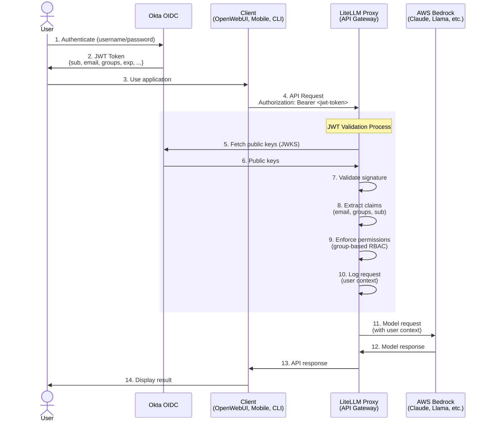

# JWT Authentication Setup Guide

## Overview

This deployment implements **client-agnostic authentication** where users authenticate via Okta OIDC and LiteLLM validates JWT tokens directly. This architecture allows any client (OpenWebUI, mobile apps, CLI tools, API integrations) to authenticate users through Okta.

## Architecture



## Benefits

✅ **Client-Agnostic**: Any client can authenticate via Okta
✅ **Per-User Tracking**: Full audit trail of user → request → cost
✅ **Secure**: Tokens expire and can be revoked, no shared secrets
✅ **Scalable**: Works for web, mobile, CLI, and API integrations
✅ **RBAC**: Enforce permissions based on Okta groups

---

## Prerequisites

### 1. Okta Configuration

You need an Okta organization with:
- An OIDC application (Web Application type)
- Custom authorization server (or use default)
- Groups configured for RBAC

### 2. AWS Infrastructure

- EKS cluster with External Secrets Operator installed
- AWS Secrets Manager configured
- ClusterSecretStore connected to AWS Secrets Manager

---

## Step 1: Create Okta OIDC Application

### 1.1 Create Application

1. Log into Okta Admin Console: `https://<your-okta-domain>/admin`
2. Navigate to **Applications** → **Applications**
3. Click **Create App Integration**
4. Select:
   - **Sign-in method**: OIDC - OpenID Connect
   - **Application type**: Web Application
5. Configure application:
   - **App integration name**: LiteLLM Gateway
   - **Grant types**:
     - ✅ Authorization Code
     - ✅ Refresh Token
   - **Sign-in redirect URIs**:
     - `https://<your-openwebui-domain>/oauth/callback`
     - `http://localhost:8080/oauth/callback` (for local testing)
   - **Sign-out redirect URIs**:
     - `https://<your-openwebui-domain>`
   - **Controlled access**: Choose appropriate assignment (e.g., "Allow everyone")

6. Click **Save**
7. **Note the following values** (you'll need these later):
   - Client ID
   - Client Secret

### 1.2 Configure Authorization Server

1. Navigate to **Security** → **API** → **Authorization Servers**
2. Select **default** (or create a custom one)
3. Note the **Issuer URI**: `https://<your-okta-domain>/oauth2/default`
4. Ensure the following scopes exist:
   - `openid` (required)
   - `email` (required)
   - `profile` (required)
   - `groups` (required for RBAC)

### 1.3 Configure Groups Claim

1. In the Authorization Server, go to **Claims** tab
2. Add a new claim:
   - **Name**: `groups`
   - **Include in token type**: ID Token, Always
   - **Value type**: Groups
   - **Filter**: Matches regex `.*` (includes all groups)
   - **Include in**: Any scope

### 1.4 Create Groups for RBAC

1. Navigate to **Directory** → **Groups**
2. Create groups for your organization:
   - `litellm-admins` - Full access
   - `litellm-users` - Standard access
   - `litellm-developers` - Developer access
3. Assign users to appropriate groups

---

## Step 2: Configure AWS Secrets Manager

### 2.1 LiteLLM Secrets

Create the JWT public key URL secret:

```bash
aws secretsmanager create-secret \
  --name litellm/jwt-public-key-url \
  --description "Okta JWKS endpoint for JWT validation" \
  --secret-string "https://<your-okta-domain>/oauth2/default/v1/keys"
```

**Replace `<your-okta-domain>`** with your actual Okta domain (e.g., `dev-123456.okta.com`)

Verify existing secrets are in place:

```bash
# Should already exist from initial setup
aws secretsmanager get-secret-value --secret-id litellm/master-key
aws secretsmanager get-secret-value --secret-id litellm/database-url
aws secretsmanager get-secret-value --secret-id litellm/salt-key
aws secretsmanager get-secret-value --secret-id litellm/redis-password
```

### 2.2 OpenWebUI Secrets

Create OpenWebUI secrets:

```bash
# WebUI session encryption key (generate a random string)
aws secretsmanager create-secret \
  --name openwebui/webui-secret-key \
  --description "OpenWebUI session encryption key" \
  --secret-string "$(openssl rand -hex 32)"

# Okta OpenID configuration URL
aws secretsmanager create-secret \
  --name openwebui/okta-openid-url \
  --description "Okta OpenID Connect discovery URL" \
  --secret-string "https://<your-okta-domain>/oauth2/default/.well-known/openid-configuration"

# Okta Client ID (from Step 1.1)
aws secretsmanager create-secret \
  --name openwebui/okta-client-id \
  --description "Okta OIDC Application Client ID" \
  --secret-string "<your-okta-client-id>"

# Okta Client Secret (from Step 1.1)
aws secretsmanager create-secret \
  --name openwebui/okta-client-secret \
  --description "Okta OIDC Application Client Secret" \
  --secret-string "<your-okta-client-secret>"

# Admin user emails (comma-separated)
aws secretsmanager create-secret \
  --name openwebui/admin-email \
  --description "Admin user email addresses" \
  --secret-string "admin@yourcompany.com,another-admin@yourcompany.com"
```

**Replace placeholders:**
- `<your-okta-domain>` - Your Okta domain
- `<your-okta-client-id>` - Client ID from Okta app
- `<your-okta-client-secret>` - Client Secret from Okta app
- Admin emails with actual admin user emails

### 2.3 Verify All Secrets

```bash
# List all secrets for verification
aws secretsmanager list-secrets --query 'SecretList[?starts_with(Name, `litellm/`) || starts_with(Name, `openwebui/`)].Name'
```

Expected output:
```json
[
    "litellm/database-url",
    "litellm/jwt-public-key-url",
    "litellm/master-key",
    "litellm/redis-password",
    "litellm/salt-key",
    "openwebui/admin-email",
    "openwebui/okta-client-id",
    "openwebui/okta-client-secret",
    "openwebui/okta-openid-url",
    "openwebui/webui-secret-key"
]
```

---

## Step 3: Deploy Configuration

### 3.1 Apply Kubernetes Manifests

```bash
# Apply ExternalSecrets (will sync from AWS Secrets Manager)
kubectl apply -f manifests/litellm-external-secret.yaml
kubectl apply -f manifests/openwebui-external-secret.yaml

# Verify secrets were created
kubectl get secrets -n litellm litellm-secrets
kubectl get secrets -n open-webui openwebui-secrets

# Check ExternalSecret sync status
kubectl get externalsecret -n litellm
kubectl get externalsecret -n open-webui
```

### 3.2 Deploy LiteLLM with JWT Authentication

```bash
# Deploy LiteLLM with updated configuration
helm upgrade --install litellm oci://ghcr.io/berriai/litellm-helm \
  --namespace litellm \
  --create-namespace \
  --values helm-values/litellm-values.yaml

# Verify deployment
kubectl get pods -n litellm
kubectl logs -n litellm -l app.kubernetes.io/name=litellm
```

### 3.3 Deploy OpenWebUI with Okta OIDC

```bash
# Add OpenWebUI Helm repo
helm repo add openwebui https://helm.openwebui.com/
helm repo update

# Deploy OpenWebUI with OAuth configuration
helm upgrade --install open-webui openwebui/open-webui \
  --namespace open-webui \
  --create-namespace \
  --values helm-values/openwebui-values.yaml

# Verify deployment
kubectl get pods -n open-webui
kubectl logs -n open-webui -l app.kubernetes.io/name=open-webui
```

---

## Step 4: Testing

### 4.1 Test OpenWebUI OAuth Flow

1. Port-forward OpenWebUI:
   ```bash
   kubectl port-forward -n open-webui svc/open-webui 8080:80
   ```

2. Open browser: `http://localhost:8080`

3. Click **Sign in with Okta**

4. You should be redirected to Okta login page

5. Enter your Okta credentials

6. After successful authentication, you should be redirected back to OpenWebUI

7. Verify your user profile shows:
   - Name from Okta
   - Email from Okta
   - Groups from Okta

### 4.2 Test LiteLLM JWT Validation

Test with a valid Okta JWT token:

```bash
# 1. Get a JWT token (from OpenWebUI session or Okta API)
# For testing, you can extract it from browser dev tools after logging in

# 2. Test LiteLLM API with JWT token
curl -X POST http://localhost:4000/v1/chat/completions \
  -H "Authorization: Bearer <your-okta-jwt-token>" \
  -H "Content-Type: application/json" \
  -d '{
    "model": "claude-3.5-sonnet",
    "messages": [
      {"role": "user", "content": "Hello, test message"}
    ]
  }'
```

Expected response: 200 OK with chat completion

Test with invalid token:

```bash
curl -X POST http://localhost:4000/v1/chat/completions \
  -H "Authorization: Bearer invalid-token" \
  -H "Content-Type: application/json" \
  -d '{
    "model": "claude-3.5-sonnet",
    "messages": [
      {"role": "user", "content": "Hello"}
    ]
  }'
```

Expected response: 401 Unauthorized

### 4.3 Verify User Tracking

Check LiteLLM database for user tracking:

```bash
# Connect to PostgreSQL
kubectl port-forward -n litellm svc/postgresql 5432:5432

# Query user requests
psql -h localhost -U litellm -d litellm -c "
  SELECT user_id, model, request_time, tokens
  FROM request_logs
  ORDER BY request_time DESC
  LIMIT 10;
"
```

You should see user emails from JWT tokens in the `user_id` column.

---

## Step 5: Advanced Configuration (Optional)

### 5.1 Configure JWT Audience Validation

For additional security, validate the JWT audience claim:

1. Update `helm-values/litellm-values.yaml`:

```yaml
general_settings:
  enable_jwt_auth: true
  jwt_public_key_url: "os.environ/JWT_PUBLIC_KEY_URL"
  jwt_audience: "api://litellm"  # Add this line
```

2. In Okta, configure the authorization server to include the audience claim:
   - Security → API → Authorization Servers → default
   - Claims → Add Claim
   - Name: `aud`
   - Value: `api://litellm`

### 5.2 Enforce Group-Based Permissions

Restrict API access based on Okta groups:

Update `helm-values/litellm-values.yaml`:

```yaml
general_settings:
  enable_jwt_auth: true
  jwt_public_key_url: "os.environ/JWT_PUBLIC_KEY_URL"

  # Enforce group membership
  allowed_routes:
    - path: "/chat/completions"
      allowed_groups: ["litellm-users", "litellm-admins", "litellm-developers"]

    - path: "/embeddings"
      allowed_groups: ["litellm-developers", "litellm-admins"]

    - path: "/admin/*"
      allowed_groups: ["litellm-admins"]
```

### 5.3 Configure Per-User Rate Limiting

```yaml
litellm_settings:
  # Per-user rate limits (extracted from JWT)
  user_api_key_rate_limit_config:
    rpm: 100  # requests per minute
    tpm: 50000  # tokens per minute
```

---

## Troubleshooting

### Issue: OpenWebUI Shows "OAuth Login Failed"

**Diagnosis:**
```bash
kubectl logs -n open-webui -l app.kubernetes.io/name=open-webui --tail=100
```

**Common Causes:**
1. Incorrect Okta client ID/secret
2. Callback URL mismatch in Okta app settings
3. Missing scopes in Okta authorization server

**Solution:**
- Verify secrets in AWS Secrets Manager
- Check Okta app redirect URIs match exactly
- Ensure `openid`, `email`, `profile`, `groups` scopes are enabled

### Issue: LiteLLM Returns "Invalid JWT Token"

**Diagnosis:**
```bash
kubectl logs -n litellm -l app.kubernetes.io/name=litellm --tail=100
```

**Common Causes:**
1. JWT public key URL incorrect
2. Token expired
3. Token signature invalid

**Solution:**
```bash
# Verify JWT_PUBLIC_KEY_URL is correct
kubectl get secret -n litellm litellm-secrets -o jsonpath='{.data.jwt-public-key-url}' | base64 -d

# Should output: https://<your-okta-domain>/oauth2/default/v1/keys

# Test the URL manually
curl https://<your-okta-domain>/oauth2/default/v1/keys
```

### Issue: User Groups Not Syncing

**Diagnosis:**
Check if groups claim is in the JWT token:

1. Decode the JWT token at https://jwt.io
2. Look for `groups` claim in the payload

**Solution:**
- Ensure groups claim is configured in Okta authorization server (Step 1.3)
- Verify user is assigned to groups in Okta
- Check `OAUTH_SCOPES` includes `groups`

### Issue: ExternalSecrets Not Syncing

**Diagnosis:**
```bash
kubectl describe externalsecret -n litellm litellm-secrets
kubectl describe externalsecret -n open-webui openwebui-secrets
```

**Solution:**
- Verify ClusterSecretStore is configured correctly
- Check IAM permissions for External Secrets Operator
- Ensure secret names match exactly in AWS Secrets Manager

---

## Security Best Practices

1. **Token Expiration**: Configure short-lived tokens in Okta (15-60 minutes)
2. **Refresh Tokens**: Enable refresh tokens for seamless re-authentication
3. **HTTPS Only**: Use HTTPS for all production deployments
4. **Secret Rotation**: Regularly rotate Okta client secrets and JWT signing keys
5. **Audit Logging**: Monitor LiteLLM request logs for unusual patterns
6. **Rate Limiting**: Implement per-user rate limits to prevent abuse
7. **Group Validation**: Only grant access to users in approved Okta groups

---

## Migration from Master-Key to JWT

If you're migrating from master-key authentication:

### Phase 1: Dual Authentication (Transition Period)

Current configuration supports both:
- Legacy clients can use master-key
- New clients can use JWT tokens

### Phase 2: JWT-Only (Production)

Once all clients are migrated:

1. Remove master-key from `litellm-values.yaml`:
   ```yaml
   general_settings:
     # master_key: "os.environ/LITELLM_MASTER_KEY"  # Remove this
     database_url: "os.environ/DATABASE_URL"
     enable_jwt_auth: true
     jwt_public_key_url: "os.environ/JWT_PUBLIC_KEY_URL"
   ```

2. Update OpenWebUI to remove `OPENAI_API_KEY` environment variable

3. Redeploy all services

---

## Additional Resources

- [LiteLLM JWT Authentication Docs](https://docs.litellm.ai/docs/proxy/token_auth)
- [Okta OIDC Documentation](https://developer.okta.com/docs/guides/implement-oauth-for-okta/)
- [OpenWebUI OAuth Configuration](https://docs.openwebui.com/getting-started/env-configuration#oauth)
- [External Secrets Operator](https://external-secrets.io/)

---

## Support

For issues or questions:
1. Check the troubleshooting section above
2. Review application logs: `kubectl logs -n <namespace> <pod-name>`
3. Verify Okta configuration in Admin Console
4. Check AWS Secrets Manager values
5. Open an issue in the project repository
