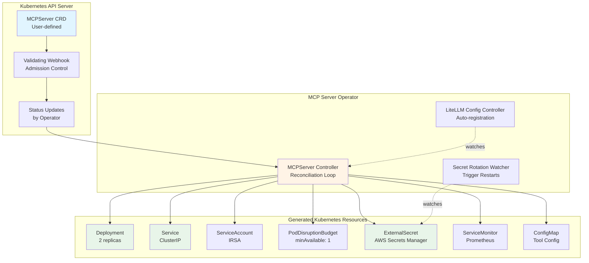

# MCP Server Operator Architecture

## Executive Summary

The **MCP Server Operator** is a Kubernetes operator that simplifies the deployment and lifecycle management of Model Context Protocol (MCP) servers in the LiteLLM EKS cluster. It reduces the complexity of deploying MCP servers from 7+ manual Kubernetes resources down to a single declarative `MCPServer` Custom Resource.

**Key Benefits:**
- **Simplified deployment**: Single YAML resource instead of 7+ manifests
- **Automated compliance**: OPA policies, security contexts, and IRSA configuration baked in
- **Self-service**: Teams can provision MCP servers without deep Kubernetes knowledge
- **Lifecycle management**: Automatic secret rotation, health monitoring, version upgrades
- **LiteLLM integration**: Auto-register MCP servers with LiteLLM proxy
- **Observability**: Automatic Prometheus/Jaeger integration

---

## Architecture Overview



---

## Custom Resource Definition (CRD)

### API Group & Versions

```yaml
apiVersion: mcp.litellm.ai/v1alpha1
kind: MCPServer
```

**API Group**: `mcp.litellm.ai`
**Versions**:
- `v1alpha1`: Initial version (experimental, schema may change)
- `v1beta1`: Stable schema (future)
- `v1`: Production-ready (future)

### Resource Spec Structure

```yaml
apiVersion: mcp.litellm.ai/v1alpha1
kind: MCPServer
metadata:
  name: github                    # MCP server name (used in service DNS)
  namespace: litellm              # Typically in litellm namespace
  labels:
    mcp.litellm.ai/category: vcs  # Categorization (vcs, cloud, messaging, etc.)
    team: platform-engineering    # Owner team

spec:
  # ============================================================================
  # Server Configuration
  # ============================================================================
  type: external-saas              # Type: external-saas, aws-service, internal-api
  transport: sse                   # Transport: sse, http

  image:
    repository: ACCOUNT_ID.dkr.ecr.us-east-1.amazonaws.com/mcp-github
    tag: "1.0.0"
    pullPolicy: IfNotPresent

  # ============================================================================
  # High Availability
  # ============================================================================
  replicas: 2

  podDisruptionBudget:
    minAvailable: 1

  affinity:
    podAntiAffinity: preferred     # preferred or required

  # ============================================================================
  # Resources
  # ============================================================================
  resources:
    requests:
      cpu: 100m
      memory: 128Mi
    limits:
      cpu: 500m
      memory: 512Mi

  # ============================================================================
  # Configuration & Secrets
  # ============================================================================
  config:                          # Non-sensitive configuration (becomes ConfigMap)
    githubOrg: "your-organization"
    maxSearchResults: 100
    logLevel: info

  secrets:                         # Sensitive data (from AWS Secrets Manager)
    - name: github-token           # Environment variable name
      awsSecretKey: mcp/github/token
      optional: false

    - name: github-app-id
      awsSecretKey: mcp/github/app-id
      optional: true

  # ============================================================================
  # AWS Integration (IRSA)
  # ============================================================================
  aws:
    iamRole: arn:aws:iam::ACCOUNT_ID:role/mcp-github-role  # Optional IRSA role

  # ============================================================================
  # Observability
  # ============================================================================
  observability:
    metrics:
      enabled: true
      port: 8080
      path: /metrics
      interval: 30s

    tracing:
      enabled: true
      jaegerEndpoint: http://jaeger-all-in-one.monitoring.svc.cluster.local:4318
      samplingRate: 1.0           # Sample all requests (0.0-1.0)

    healthProbes:
      liveness:
        path: /health
        initialDelaySeconds: 10
        periodSeconds: 10
      readiness:
        path: /ready
        initialDelaySeconds: 5
        periodSeconds: 5

  # ============================================================================
  # LiteLLM Integration
  # ============================================================================
  litellm:
    autoRegister: true             # Auto-add to LiteLLM mcp_servers config
    allowedUserGroups:             # Access control (future feature)
      - litellm-developers
      - litellm-admins

status:
  # ============================================================================
  # Operator-managed status
  # ============================================================================
  phase: Ready                     # Pending, Creating, Ready, Failed, Updating

  conditions:
    - type: DeploymentReady
      status: "True"
      lastTransitionTime: "2025-12-08T10:30:00Z"
      reason: MinimumReplicasAvailable
      message: "Deployment has 2/2 ready replicas"

    - type: ExternalSecretSynced
      status: "True"
      lastTransitionTime: "2025-12-08T10:29:45Z"
      reason: SecretSynced
      message: "All secrets synced from AWS Secrets Manager"

    - type: ServiceMonitorCreated
      status: "True"
      lastTransitionTime: "2025-12-08T10:29:50Z"
      reason: MonitoringEnabled
      message: "Prometheus ServiceMonitor configured"

    - type: LiteLLMRegistered
      status: "True"
      lastTransitionTime: "2025-12-08T10:30:05Z"
      reason: AutoRegistered
      message: "Registered with LiteLLM proxy"

  endpoints:
    service: http://mcp-github.litellm.svc.cluster.local:8080
    metrics: http://mcp-github.litellm.svc.cluster.local:8080/metrics

  observedGeneration: 1            # Tracks spec changes
  lastUpdated: "2025-12-08T10:30:05Z"
```

---

## Operator Components

### 1. MCPServer Controller (Primary Reconciler)

**Responsibilities:**
- Watch `MCPServer` resources for create/update/delete events
- Reconcile desired state (spec) with actual state
- Create/update/delete child resources (Deployment, Service, etc.)
- Update `MCPServer` status conditions
- Handle errors and retry with exponential backoff

**Reconciliation Logic:**

```go
func (r *MCPServerReconciler) Reconcile(ctx context.Context, req ctrl.Request) (ctrl.Result, error) {
    log := log.FromContext(ctx)

    // 1. Fetch MCPServer resource
    mcpServer := &mcpv1alpha1.MCPServer{}
    if err := r.Get(ctx, req.NamespacedName, mcpServer); err != nil {
        if errors.IsNotFound(err) {
            // Resource deleted, cleanup handled by owner references
            return ctrl.Result{}, nil
        }
        return ctrl.Result{}, err
    }

    // 2. Validate spec (additional validation beyond webhook)
    if err := r.validateSpec(mcpServer); err != nil {
        r.updateCondition(mcpServer, "SpecValid", metav1.ConditionFalse, err.Error())
        return ctrl.Result{}, err
    }

    // 3. Reconcile child resources (order matters!)
    // 3a. ServiceAccount (needed for IRSA)
    if err := r.reconcileServiceAccount(ctx, mcpServer); err != nil {
        return ctrl.Result{}, err
    }

    // 3b. ExternalSecret (secrets must exist before Deployment)
    if err := r.reconcileExternalSecret(ctx, mcpServer); err != nil {
        r.updateCondition(mcpServer, "ExternalSecretSynced", metav1.ConditionFalse, err.Error())
        return ctrl.Result{RequeueAfter: 30 * time.Second}, err
    }
    r.updateCondition(mcpServer, "ExternalSecretSynced", metav1.ConditionTrue, "Secrets synced")

    // 3c. ConfigMap (for non-sensitive config)
    if err := r.reconcileConfigMap(ctx, mcpServer); err != nil {
        return ctrl.Result{}, err
    }

    // 3d. Deployment (main workload)
    if err := r.reconcileDeployment(ctx, mcpServer); err != nil {
        r.updateCondition(mcpServer, "DeploymentReady", metav1.ConditionFalse, err.Error())
        return ctrl.Result{}, err
    }

    // 3e. Check Deployment readiness
    ready, err := r.isDeploymentReady(ctx, mcpServer)
    if err != nil {
        return ctrl.Result{}, err
    }
    if !ready {
        r.updateCondition(mcpServer, "DeploymentReady", metav1.ConditionFalse, "Waiting for replicas")
        return ctrl.Result{RequeueAfter: 10 * time.Second}, nil
    }
    r.updateCondition(mcpServer, "DeploymentReady", metav1.ConditionTrue, "All replicas ready")

    // 3f. Service (ClusterIP)
    if err := r.reconcileService(ctx, mcpServer); err != nil {
        return ctrl.Result{}, err
    }

    // 3g. PodDisruptionBudget
    if err := r.reconcilePDB(ctx, mcpServer); err != nil {
        return ctrl.Result{}, err
    }

    // 3h. ServiceMonitor (Prometheus)
    if mcpServer.Spec.Observability.Metrics.Enabled {
        if err := r.reconcileServiceMonitor(ctx, mcpServer); err != nil {
            r.updateCondition(mcpServer, "ServiceMonitorCreated", metav1.ConditionFalse, err.Error())
            return ctrl.Result{}, err
        }
        r.updateCondition(mcpServer, "ServiceMonitorCreated", metav1.ConditionTrue, "Metrics available")
    }

    // 4. Update LiteLLM configuration (if auto-register enabled)
    if mcpServer.Spec.LiteLLM.AutoRegister {
        if err := r.registerWithLiteLLM(ctx, mcpServer); err != nil {
            r.updateCondition(mcpServer, "LiteLLMRegistered", metav1.ConditionFalse, err.Error())
            return ctrl.Result{RequeueAfter: 30 * time.Second}, err
        }
        r.updateCondition(mcpServer, "LiteLLMRegistered", metav1.ConditionTrue, "Registered")
    }

    // 5. Update status.phase and endpoints
    mcpServer.Status.Phase = "Ready"
    mcpServer.Status.Endpoints.Service = fmt.Sprintf("http://%s.%s.svc.cluster.local:%d",
        mcpServer.Name, mcpServer.Namespace, 8080)
    mcpServer.Status.Endpoints.Metrics = mcpServer.Status.Endpoints.Service + "/metrics"
    mcpServer.Status.ObservedGeneration = mcpServer.Generation
    mcpServer.Status.LastUpdated = metav1.Now()

    if err := r.Status().Update(ctx, mcpServer); err != nil {
        return ctrl.Result{}, err
    }

    log.Info("MCPServer reconciled successfully", "name", mcpServer.Name)
    return ctrl.Result{}, nil
}
```

**Key Design Decisions:**

1. **Owner References**: All child resources have `ownerReferences` set to the parent `MCPServer`. This enables automatic garbage collection when the MCPServer is deleted.

2. **Declarative Updates**: Use `ctrl.CreateOrUpdate()` pattern (server-side apply) to handle both creation and updates idempotently.

3. **Status Conditions**: Follow Kubernetes conventions with typed conditions (`DeploymentReady`, `ExternalSecretSynced`, etc.) instead of unstructured status messages.

4. **Requeue Strategy**:
   - Immediate retry: Transient API errors
   - 10s requeue: Waiting for pod readiness
   - 30s requeue: External dependency failures (ExternalSecret sync, LiteLLM registration)
   - No requeue: Successful reconciliation (watch events trigger next reconcile)

### 2. LiteLLM Config Controller

**Responsibilities:**
- Watch all `MCPServer` resources with `spec.litellm.autoRegister: true`
- Update LiteLLM ConfigMap with MCP server registry
- Trigger LiteLLM pod restart when config changes (optional)

**Implementation Pattern:**

```go
func (r *LiteLLMConfigReconciler) Reconcile(ctx context.Context, req ctrl.Request) (ctrl.Result, error) {
    // 1. List all MCPServer resources across all namespaces
    mcpServerList := &mcpv1alpha1.MCPServerList{}
    if err := r.List(ctx, mcpServerList); err != nil {
        return ctrl.Result{}, err
    }

    // 2. Filter servers with autoRegister: true and phase: Ready
    var registeredServers []mcpv1alpha1.MCPServer
    for _, server := range mcpServerList.Items {
        if server.Spec.LiteLLM.AutoRegister && server.Status.Phase == "Ready" {
            registeredServers = append(registeredServers, server)
        }
    }

    // 3. Generate LiteLLM mcp_servers configuration
    mcpConfig := r.generateMCPConfig(registeredServers)

    // 4. Update LiteLLM ConfigMap (or Helm values)
    configMap := &corev1.ConfigMap{}
    if err := r.Get(ctx, types.NamespacedName{
        Name:      "litellm-config",
        Namespace: "litellm",
    }, configMap); err != nil {
        return ctrl.Result{}, err
    }

    configMap.Data["mcp_servers.yaml"] = mcpConfig
    if err := r.Update(ctx, configMap); err != nil {
        return ctrl.Result{}, err
    }

    // 5. Optional: Trigger rolling restart of LiteLLM pods
    // (Only if LiteLLM doesn't support hot-reload)
    if r.shouldRestartLiteLLM(configMap) {
        if err := r.restartLiteLLMPods(ctx); err != nil {
            return ctrl.Result{}, err
        }
    }

    return ctrl.Result{}, nil
}
```

**Generated LiteLLM Config:**

```yaml
# Auto-generated by MCP Operator
# DO NOT EDIT MANUALLY - changes will be overwritten
mcp_servers:
  - server_name: github
    endpoint: http://mcp-github.litellm.svc.cluster.local:8080
    transport: sse
    description: "Auto-registered from MCPServer/github"
    metadata:
      managed_by: mcp-operator
      crd_name: github
      crd_namespace: litellm

  - server_name: slack
    endpoint: http://mcp-slack.litellm.svc.cluster.local:8080
    transport: http
    description: "Auto-registered from MCPServer/slack"
    metadata:
      managed_by: mcp-operator
      crd_name: slack
      crd_namespace: litellm
```

### 3. Validating Admission Webhook

**Responsibilities:**
- Validate `MCPServer` spec before it's persisted to etcd
- Enforce constraints (image registry, transport type, required fields)
- Provide immediate feedback to users on invalid specs

**Validation Rules:**

```go
func (v *MCPServerValidator) ValidateCreate(ctx context.Context, obj runtime.Object) error {
    mcpServer := obj.(*mcpv1alpha1.MCPServer)

    var allErrs field.ErrorList

    // 1. Validate image repository (must be approved ECR or registry)
    if !v.isApprovedRegistry(mcpServer.Spec.Image.Repository) {
        allErrs = append(allErrs, field.Invalid(
            field.NewPath("spec", "image", "repository"),
            mcpServer.Spec.Image.Repository,
            "image must be from approved registry (AWS ECR or allowlisted registry)",
        ))
    }

    // 2. Validate image tag (no :latest)
    if mcpServer.Spec.Image.Tag == "latest" || mcpServer.Spec.Image.Tag == "" {
        allErrs = append(allErrs, field.Invalid(
            field.NewPath("spec", "image", "tag"),
            mcpServer.Spec.Image.Tag,
            "image tag must be specified and cannot be 'latest'",
        ))
    }

    // 3. Validate transport type
    if mcpServer.Spec.Transport != "sse" && mcpServer.Spec.Transport != "http" {
        allErrs = append(allErrs, field.NotSupported(
            field.NewPath("spec", "transport"),
            mcpServer.Spec.Transport,
            []string{"sse", "http"},
        ))
    }

    // 4. Validate resource limits defined
    if mcpServer.Spec.Resources.Limits.Cpu().IsZero() ||
       mcpServer.Spec.Resources.Limits.Memory().IsZero() {
        allErrs = append(allErrs, field.Required(
            field.NewPath("spec", "resources", "limits"),
            "CPU and memory limits must be defined (OPA requirement)",
        ))
    }

    // 5. Validate replicas >= 1
    if mcpServer.Spec.Replicas < 1 {
        allErrs = append(allErrs, field.Invalid(
            field.NewPath("spec", "replicas"),
            mcpServer.Spec.Replicas,
            "replicas must be at least 1",
        ))
    }

    // 6. Validate AWS secrets exist (if specified)
    for i, secret := range mcpServer.Spec.Secrets {
        if !secret.Optional && secret.AWSSecretKey == "" {
            allErrs = append(allErrs, field.Required(
                field.NewPath("spec", "secrets").Index(i).Child("awsSecretKey"),
                "awsSecretKey is required for non-optional secrets",
            ))
        }
    }

    if len(allErrs) > 0 {
        return apierrors.NewInvalid(
            schema.GroupKind{Group: "mcp.litellm.ai", Kind: "MCPServer"},
            mcpServer.Name,
            allErrs,
        )
    }

    return nil
}
```

**User Experience:**

```bash
# User attempts to create MCPServer with invalid spec
kubectl apply -f mcp-github.yaml

# Immediate validation error
Error from server (Invalid): error when creating "mcp-github.yaml":
  MCPServer.mcp.litellm.ai "github" is invalid:
  - spec.image.tag: Invalid value: "latest": image tag must be specified and cannot be 'latest'
  - spec.resources.limits: Required value: CPU and memory limits must be defined (OPA requirement)
```

---

## Integration Points

### 1. External Secrets Operator

**Pattern:**
```yaml
# Generated by MCP Operator
apiVersion: external-secrets.io/v1
kind: ExternalSecret
metadata:
  name: mcp-github-secrets
  namespace: litellm
  ownerReferences:
    - apiVersion: mcp.litellm.ai/v1alpha1
      kind: MCPServer
      name: github
      uid: <uid>
      controller: true
spec:
  refreshInterval: 1h
  secretStoreRef:
    name: aws-secrets-manager
    kind: ClusterSecretStore
  target:
    name: mcp-github-secrets
    creationPolicy: Owner
  data:
    - secretKey: github-token
      remoteRef:
        key: mcp/github/token
```

**Secret Rotation Handling:**
- Watch `ExternalSecret` status for sync failures
- When secret changes in AWS Secrets Manager, ESO updates Kubernetes Secret
- Operator watches Secret updates and triggers pod restart via annotation change

### 2. OPA Gatekeeper Compliance

**Automatic Compliance:**
The operator generates resources that automatically comply with all OPA policies:

- **Allowed Repos**: Uses `spec.image.repository` from validated list
- **Block Latest Tag**: Enforced by webhook validation
- **Container Limits**: Required by CRD schema
- **Pod Security**: Hardcoded `securityContext` in generated Deployment
- **Require Probes**: Automatically added from `spec.observability.healthProbes`
- **Required Labels**: Operator adds standard labels automatically

### 3. Prometheus Operator

**Generated ServiceMonitor:**
```yaml
apiVersion: monitoring.coreos.com/v1
kind: ServiceMonitor
metadata:
  name: mcp-github
  namespace: monitoring
  labels:
    release: kube-prometheus  # Required for discovery
  ownerReferences:
    - apiVersion: mcp.litellm.ai/v1alpha1
      kind: MCPServer
      name: github
      uid: <uid>
spec:
  namespaceSelector:
    matchNames:
      - litellm
  selector:
    matchLabels:
      app.kubernetes.io/name: mcp-github
  endpoints:
    - port: http
      path: /metrics
      interval: 30s
```

### 4. LiteLLM Proxy

**Auto-Registration Options:**

**Option A: ConfigMap Injection**
```yaml
# litellm ConfigMap updated by operator
apiVersion: v1
kind: ConfigMap
metadata:
  name: litellm-config
  namespace: litellm
data:
  config.yaml: |
    litellm_settings:
      mcp_servers: |
        # Auto-generated - do not edit
        - server_name: github
          endpoint: http://mcp-github.litellm.svc:8080
          transport: sse
```

**Option B: API-based Registration** (if LiteLLM supports it)
```go
// Operator calls LiteLLM admin API
POST http://litellm-proxy.litellm.svc:4000/admin/mcp/servers
{
  "server_name": "github",
  "endpoint": "http://mcp-github.litellm.svc:8080",
  "transport": "sse"
}
```

---

## Deployment & Installation

### Operator Deployment

```yaml
# Namespace
apiVersion: v1
kind: Namespace
metadata:
  name: mcp-operator-system

---
# Operator Deployment
apiVersion: apps/v1
kind: Deployment
metadata:
  name: mcp-operator-controller-manager
  namespace: mcp-operator-system
spec:
  replicas: 2  # HA for production
  selector:
    matchLabels:
      control-plane: controller-manager
  template:
    metadata:
      labels:
        control-plane: controller-manager
    spec:
      serviceAccountName: mcp-operator-controller-manager
      containers:
      - name: manager
        image: ACCOUNT_ID.dkr.ecr.us-east-1.amazonaws.com/mcp-operator:v1.0.0
        command:
        - /manager
        args:
        - --leader-elect
        - --health-probe-bind-address=:8081
        - --metrics-bind-address=:8080
        env:
        - name: ENABLE_WEBHOOKS
          value: "true"
        resources:
          requests:
            cpu: 100m
            memory: 64Mi
          limits:
            cpu: 500m
            memory: 256Mi
        livenessProbe:
          httpGet:
            path: /healthz
            port: 8081
        readinessProbe:
          httpGet:
            path: /readyz
            port: 8081
```

### Installation Steps

```bash
# 1. Install CRDs
kubectl apply -f https://raw.githubusercontent.com/your-org/mcp-operator/main/config/crd/bases/mcp.litellm.ai_mcpservers.yaml

# 2. Install operator
kubectl apply -f https://raw.githubusercontent.com/your-org/mcp-operator/main/config/manager/manager.yaml

# 3. Verify operator is running
kubectl get pods -n mcp-operator-system

# 4. Create first MCPServer
kubectl apply -f - <<EOF
apiVersion: mcp.litellm.ai/v1alpha1
kind: MCPServer
metadata:
  name: github
  namespace: litellm
spec:
  type: external-saas
  transport: sse
  image:
    repository: ACCOUNT_ID.dkr.ecr.us-east-1.amazonaws.com/mcp-github
    tag: "1.0.0"
  replicas: 2
  secrets:
    - name: github-token
      awsSecretKey: mcp/github/token
  observability:
    metrics:
      enabled: true
    tracing:
      enabled: true
  litellm:
    autoRegister: true
EOF

# 5. Check status
kubectl get mcpserver github -n litellm
kubectl describe mcpserver github -n litellm
```

---

## Comparison: Before vs After

### Before (Manual Deployment)

**Files needed:** 7 separate manifests

```bash
manifests/
├── mcp-github-deployment.yaml       # 100 lines
├── mcp-github-service.yaml          # 15 lines
├── mcp-github-serviceaccount.yaml   # 10 lines
├── mcp-github-pdb.yaml              # 12 lines
├── mcp-github-externalsecret.yaml   # 25 lines
├── mcp-github-servicemonitor.yaml   # 20 lines
└── mcp-github-configmap.yaml        # 15 lines

Total: 197 lines of YAML
```

**Deployment:**
```bash
kubectl apply -f manifests/
# Manual verification of each resource
kubectl get deployment,svc,sa,pdb,externalsecret,servicemonitor -n litellm
# Manual update of LiteLLM config
kubectl edit configmap litellm-config -n litellm
# Manual LiteLLM restart
kubectl rollout restart deployment/litellm-proxy -n litellm
```

### After (Operator-managed)

**Files needed:** 1 manifest

```yaml
# mcp-github.yaml (30 lines)
apiVersion: mcp.litellm.ai/v1alpha1
kind: MCPServer
metadata:
  name: github
  namespace: litellm
spec:
  type: external-saas
  transport: sse
  image:
    repository: ACCOUNT_ID.dkr.ecr.us-east-1.amazonaws.com/mcp-github
    tag: "1.0.0"
  replicas: 2
  resources:
    requests:
      cpu: 100m
      memory: 128Mi
    limits:
      cpu: 500m
      memory: 512Mi
  secrets:
    - name: github-token
      awsSecretKey: mcp/github/token
  observability:
    metrics:
      enabled: true
    tracing:
      enabled: true
  litellm:
    autoRegister: true
```

**Deployment:**
```bash
kubectl apply -f mcp-github.yaml
# Everything else happens automatically
kubectl get mcpserver github -n litellm
```

**Lines of YAML:** 197 → 30 (85% reduction)
**Manual steps:** 6 → 1 (83% reduction)

---

## Development Roadmap

### Phase 1: MVP (v1alpha1)
- [ ] CRD definition with basic spec
- [ ] MCPServer controller with Deployment/Service/PDB reconciliation
- [ ] ExternalSecret integration
- [ ] ServiceMonitor generation
- [ ] Validating webhook for basic validation
- [ ] Manual LiteLLM configuration (no auto-register)

### Phase 2: Auto-registration (v1alpha2)
- [ ] LiteLLM Config Controller
- [ ] Auto-registration with LiteLLM proxy
- [ ] ConfigMap hot-reload or pod restart trigger
- [ ] Status conditions for registration state

### Phase 3: Advanced Features (v1beta1)
- [ ] Secret rotation detection and pod restarts
- [ ] Horizontal Pod Autoscaler (HPA) support
- [ ] Network Policy generation
- [ ] Multi-namespace support with cluster-scoped operator
- [ ] Health check monitoring and alerting
- [ ] Grafana dashboard auto-creation

### Phase 4: Production Hardening (v1)
- [ ] Leader election for HA operator deployment
- [ ] Admission webhook HA with cert-manager
- [ ] Comprehensive end-to-end tests
- [ ] Performance optimization (watch caching, batch reconciles)
- [ ] Upgrade path from v1alpha1 to v1 (conversion webhooks)
- [ ] Detailed metrics and operator dashboard

---

## Technology Stack

### Operator Framework: Kubebuilder

**Why Kubebuilder:**
- Industry standard for Go-based operators
- Scaffolds project structure, CRDs, controllers, webhooks
- Built-in support for leader election, metrics, health checks
- Active community and good documentation

**Alternative: Operator SDK**
- Similar to Kubebuilder (built on top of it)
- More opinionated, includes Helm/Ansible operator options

### Language: Go

**Why Go:**
- Native Kubernetes client libraries (`client-go`, `controller-runtime`)
- Strong typing for CRD structs
- High performance, low memory footprint
- Kubebuilder generates Go code

### Dependencies

```go
// go.mod
module github.com/your-org/mcp-operator

go 1.22

require (
    k8s.io/api v0.29.0
    k8s.io/apimachinery v0.29.0
    k8s.io/client-go v0.29.0
    sigs.k8s.io/controller-runtime v0.17.0

    // External Secrets integration
    github.com/external-secrets/external-secrets v0.9.0

    // Prometheus Operator integration
    github.com/prometheus-operator/prometheus-operator/pkg/apis/monitoring v0.70.0
)
```

---

## Security Considerations

### Operator RBAC

**Minimum required permissions:**

```yaml
apiVersion: rbac.authorization.k8s.io/v1
kind: ClusterRole
metadata:
  name: mcp-operator-manager-role
rules:
# MCPServer CRD
- apiGroups: ["mcp.litellm.ai"]
  resources: ["mcpservers"]
  verbs: ["get", "list", "watch", "create", "update", "patch", "delete"]
- apiGroups: ["mcp.litellm.ai"]
  resources: ["mcpservers/status"]
  verbs: ["get", "update", "patch"]

# Child resources
- apiGroups: ["apps"]
  resources: ["deployments"]
  verbs: ["get", "list", "watch", "create", "update", "patch", "delete"]
- apiGroups: [""]
  resources: ["services", "serviceaccounts", "configmaps"]
  verbs: ["get", "list", "watch", "create", "update", "patch", "delete"]
- apiGroups: ["policy"]
  resources: ["poddisruptionbudgets"]
  verbs: ["get", "list", "watch", "create", "update", "patch", "delete"]

# External Secrets Operator integration
- apiGroups: ["external-secrets.io"]
  resources: ["externalsecrets"]
  verbs: ["get", "list", "watch", "create", "update", "patch", "delete"]

# Prometheus Operator integration
- apiGroups: ["monitoring.coreos.com"]
  resources: ["servicemonitors"]
  verbs: ["get", "list", "watch", "create", "update", "patch", "delete"]

# Leader election
- apiGroups: ["coordination.k8s.io"]
  resources: ["leases"]
  verbs: ["get", "list", "watch", "create", "update", "patch", "delete"]
```

### Webhook Security

**Certificate Management:**
- Use cert-manager for automatic TLS certificate generation and rotation
- Webhook server requires valid TLS certificates for admission control

```yaml
apiVersion: cert-manager.io/v1
kind: Certificate
metadata:
  name: mcp-operator-serving-cert
  namespace: mcp-operator-system
spec:
  dnsNames:
  - mcp-operator-webhook-service.mcp-operator-system.svc
  - mcp-operator-webhook-service.mcp-operator-system.svc.cluster.local
  issuerRef:
    kind: Issuer
    name: mcp-operator-selfsigned-issuer
  secretName: webhook-server-cert
```

---

## Monitoring & Observability

### Operator Metrics

**Exposed metrics (Prometheus format):**

```
# Controller metrics
controller_runtime_reconcile_total{controller="mcpserver",result="success"} 150
controller_runtime_reconcile_total{controller="mcpserver",result="error"} 5
controller_runtime_reconcile_time_seconds{controller="mcpserver",quantile="0.99"} 0.25

# Custom metrics
mcp_operator_mcpservers_total{phase="Ready"} 12
mcp_operator_mcpservers_total{phase="Failed"} 1
mcp_operator_reconcile_errors_total{controller="mcpserver",error_type="external_secret_sync"} 3
```

### Operator Logs

**Structured logging:**
```json
{
  "level": "info",
  "ts": 1702056000.123456,
  "msg": "Reconciling MCPServer",
  "controller": "mcpserver",
  "namespace": "litellm",
  "name": "github",
  "generation": 2
}
```

---

## FAQ

### Q: Can I still deploy MCP servers manually?
**A:** Yes! The operator is optional. Manual manifests continue to work.

### Q: What happens if I delete an MCPServer resource?
**A:** All child resources (Deployment, Service, ExternalSecret, etc.) are automatically deleted via owner references. The MCP server is also removed from LiteLLM config.

### Q: Can I customize the generated Deployment beyond the CRD spec?
**A:** Not directly. For advanced customization, deploy manually. The CRD is opinionated to enforce best practices.

### Q: How do I update an MCP server version?
**A:** Update `spec.image.tag` in the MCPServer resource. The operator triggers a rolling update.

### Q: Does the operator support multi-cluster deployments?
**A:** Not in v1alpha1. Each cluster needs its own operator instance.

### Q: Can I use this with non-AWS secret managers (HashiCorp Vault, GCP Secret Manager)?
**A:** Yes, if External Secrets Operator supports it. Update the `ClusterSecretStore` configuration.

---

## Next Steps

1. **Review this architecture** and provide feedback
2. **Define the complete CRD schema** with all fields
3. **Choose operator framework** (Kubebuilder recommended)
4. **Scaffold operator project** with Kubebuilder CLI
5. **Implement MVP** (Phase 1)
6. **Deploy to test cluster** and iterate
7. **Production deployment** after validation

---

## References

- **Kubebuilder Documentation**: https://book.kubebuilder.io/
- **Operator Best Practices**: https://sdk.operatorframework.io/docs/best-practices/
- **Controller Runtime**: https://pkg.go.dev/sigs.k8s.io/controller-runtime
- **External Secrets Operator API**: https://external-secrets.io/latest/api/
- **Prometheus Operator CRDs**: https://github.com/prometheus-operator/prometheus-operator/blob/main/Documentation/design.md
