# LiteLLM Deployment Dependency Diagram

## Overview

This document visualizes the deployment dependencies for the LiteLLM EKS infrastructure, showing the relationships between components and the correct deployment order.

## Prerequisites

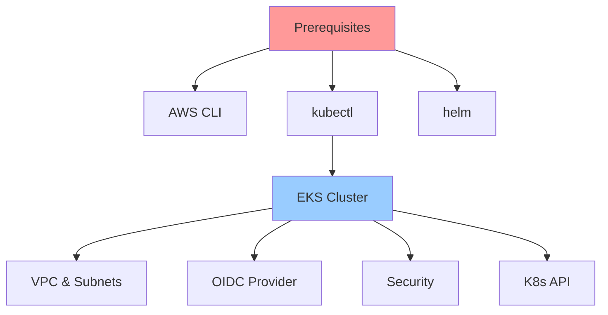

## Phase 1: Foundation Resources

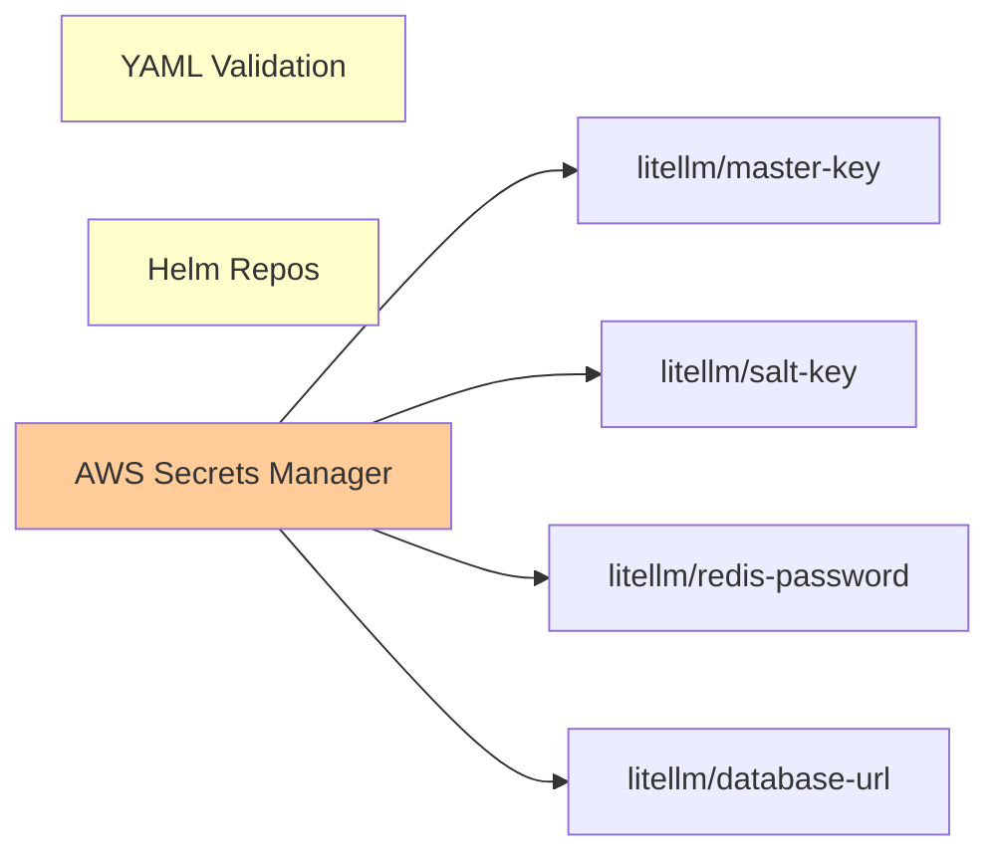

## Phase 2: IAM & Namespaces

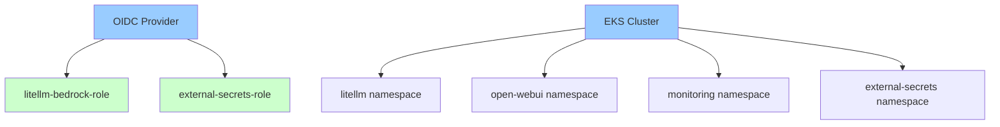

## Phase 3: External Secrets Operator

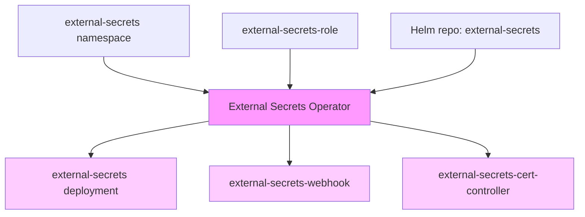

## Phase 4: Secret Stores & Secret Sync

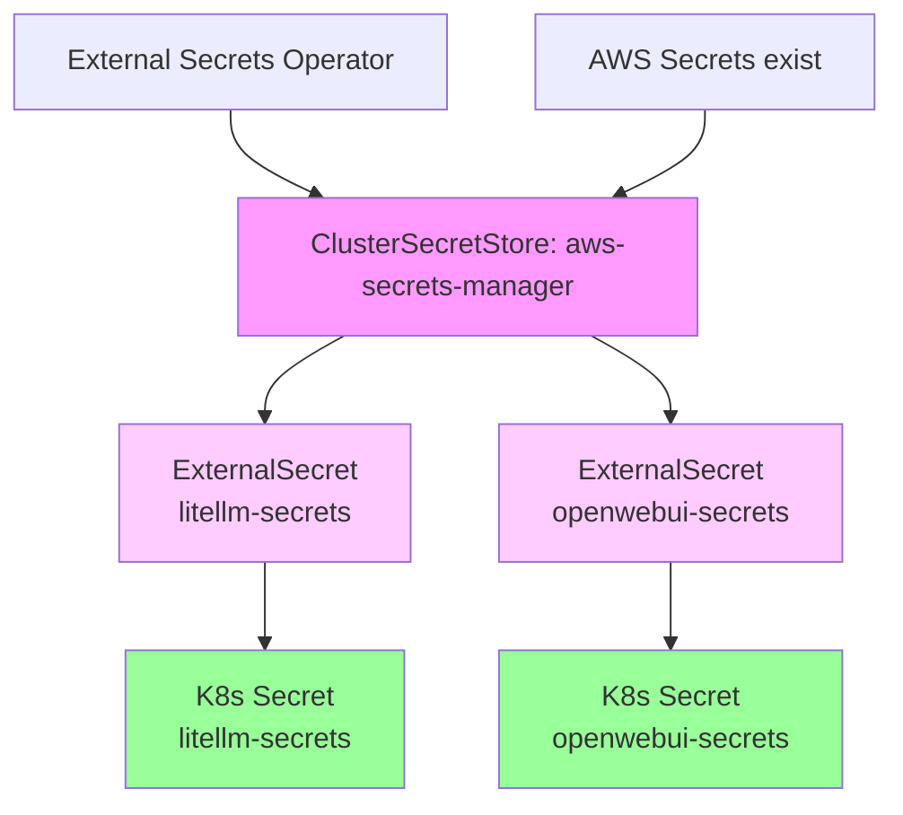

## Phase 5: Observability Stack

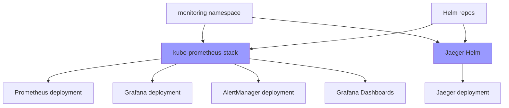

## Phase 6: Redis (Data Layer)

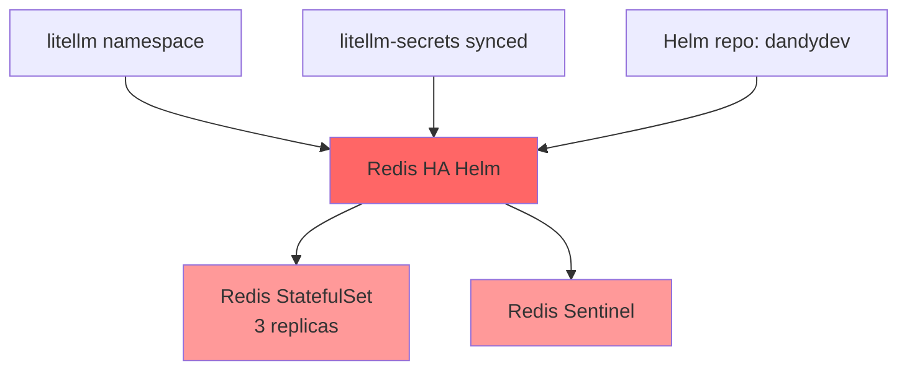

## Phase 7: LiteLLM (Application Layer)

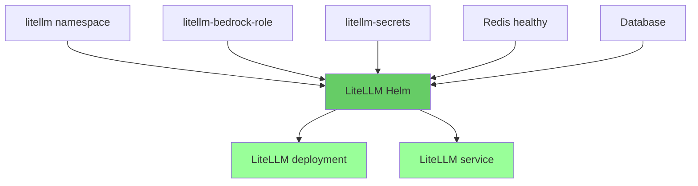

## Phase 8: OpenWebUI (Frontend Layer)

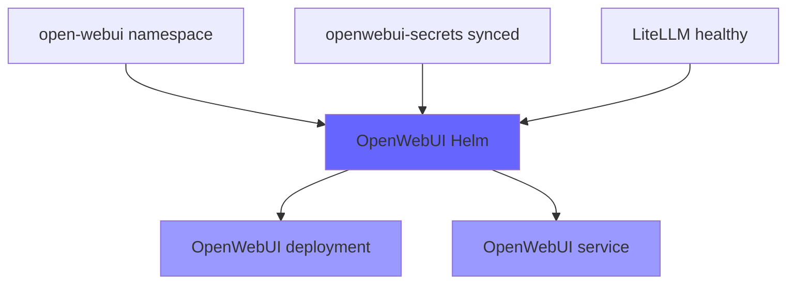

## Critical Dependency Paths

### Path 1: Secrets Flow

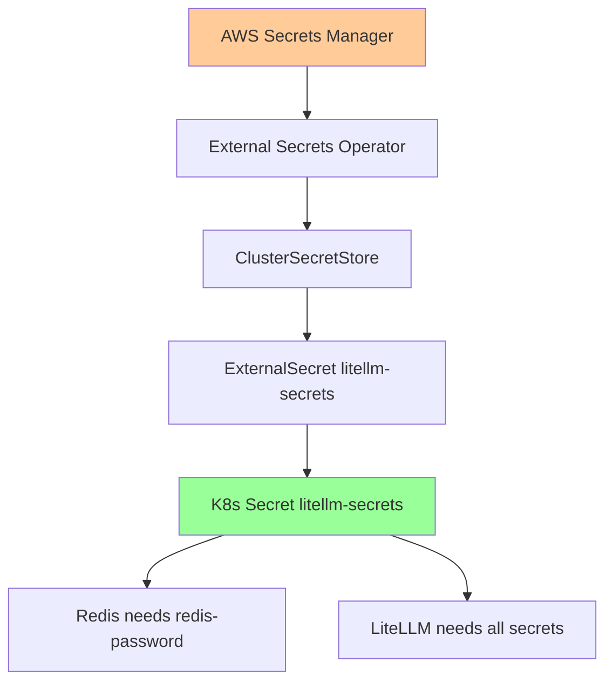

### Path 2: LiteLLM Deployment Flow

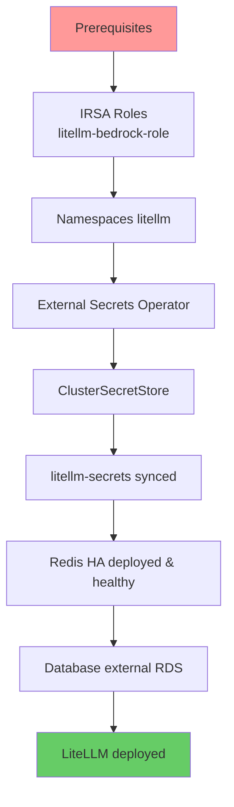

### Path 3: OpenWebUI Full Stack

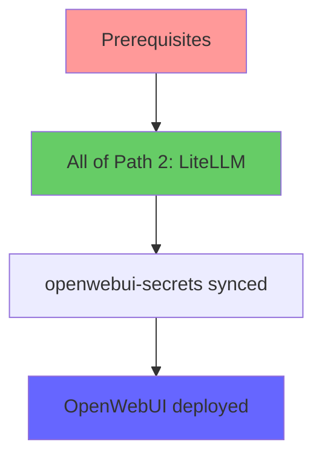

## Complete Deployment Flow

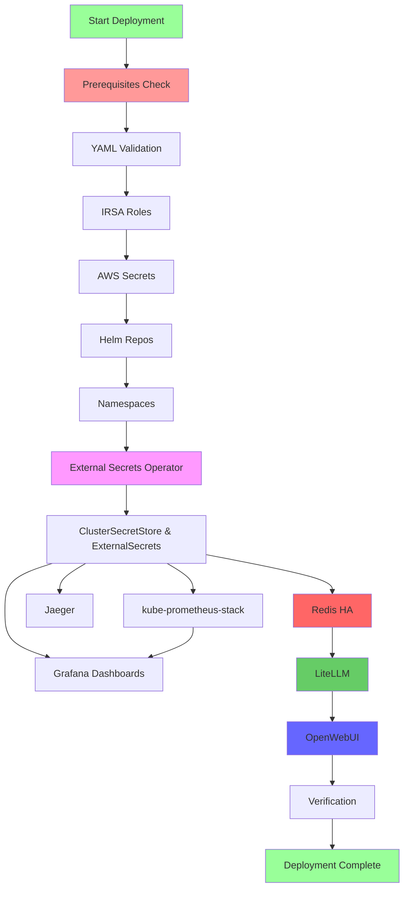

## Bastion Host Architecture

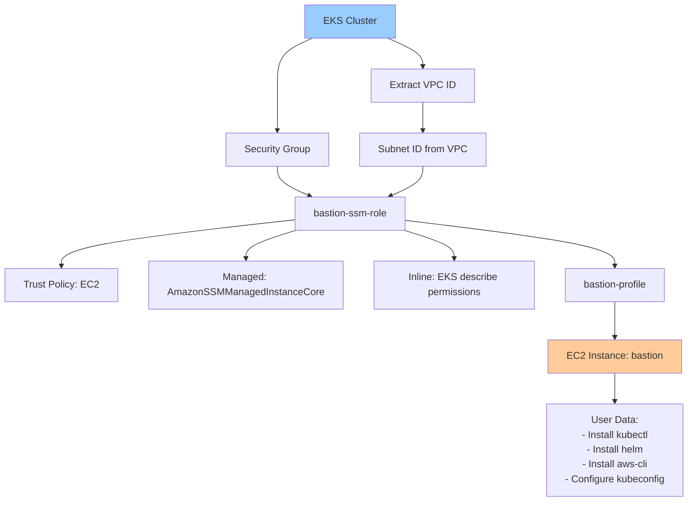

## Skip Validation Rules

### ✓ CAN SKIP if:
- Resource exists AND is healthy
- No dependent resources being deployed
- User explicitly chooses to skip

### ✗ CANNOT SKIP if:
- Resource doesn't exist
- Resource exists but is unhealthy (status != "deployed" for Helm)
- Dependent resource is being deployed in this session
- Resource is marked as critical dependency

### ⚠️ WARN BEFORE SKIP if:
- Resource is critical (external-secrets, redis)
- Resource has dependents deployed

### 🛑 BLOCK PROCEED if:
- Regenerating `litellm/salt-key` (data corruption risk)

### ⚠️ DOUBLE CONFIRM before:
- Regenerating `litellm/master-key` (breaks all API keys)
- Terminating existing bastion instance
- Changing `litellm/database-url` (different database)

## Deployment Order Summary

| Phase | Component | Can Skip? | Notes |
|-------|-----------|-----------|-------|
| 1 | Prerequisites Check | ❌ Never | Always first, never skip |
| 2 | YAML Validation | ⚠️ Not recommended | Fast failure, recommend always run |
| 3 | IRSA Roles | ✅ If exists & healthy | Can skip if exist & healthy |
| 4 | AWS Secrets | ⚠️ With warning | Can skip if exist, WARN on regenerate |
| 5 | Helm Repos | ✅ Yes | Can skip, idempotent |
| 6 | Namespaces | ✅ If exists | Can skip if exist |
| 7 | External Secrets Operator | ⚠️ Critical | Can skip if healthy, CRITICAL dependency |
| 8 | ClusterSecretStore & ExternalSecrets | ✅ If synced | Can skip if secrets synced |
| 9 | kube-prometheus-stack | ✅ If healthy | Can skip if healthy, independent |
| 10 | Grafana Dashboards | ✅ Yes | Can skip, requires prometheus |
| 11 | Jaeger | ✅ If healthy | Can skip if healthy, independent |
| 12 | Redis HA | ⚠️ Critical | Can skip if healthy, CRITICAL for LiteLLM |
| 13 | LiteLLM | ⚠️ Critical | Can skip if healthy, CRITICAL for OpenWebUI |
| 14 | OpenWebUI | ✅ If healthy | Can skip if healthy, depends on LiteLLM |
| 15 | Verification | ⚠️ Recommended | Always last, recommended |
