# LiteLLM Deployment Scripts

This directory contains deployment scripts for deploying LiteLLM + OpenWebUI on AWS EKS with a complete observability stack.

## Overview

The deployment process is split into two phases:

1. **Infrastructure Provisioning** (Terraform) - Creates AWS infrastructure (VPC, EKS, RDS, etc.)
2. **Application Deployment** (Kubernetes) - Deploys applications to the EKS cluster

## Quick Start

### Complete Deployment (From Scratch)

Deploy everything with a single command:

```bash
./deploy.sh complete
```

This will:
1. Deploy infrastructure using Terraform (VPC, EKS, RDS, Secrets Manager)
2. Configure kubectl to connect to the new cluster
3. Deploy all applications (LiteLLM, OpenWebUI, Redis, monitoring)

### Step-by-Step Deployment

If you prefer more control:

```bash
# 1. Deploy infrastructure
./deploy.sh infrastructure

# 2. Configure kubectl (command will be shown in output)
aws eks update-kubeconfig --name litellm-eks --region us-east-1

# 3. Deploy applications
./deploy.sh all
```

## Scripts

### `deploy.sh`

Main deployment script that handles both infrastructure provisioning and application deployment.

#### Infrastructure Commands

| Command | Description |
|---------|-------------|
| `infrastructure`, `infra` | Deploy AWS infrastructure using Terraform |
| `infrastructure-plan`, `infra-plan` | Show what infrastructure changes would be made |
| `infrastructure-verify`, `infra-verify` | Verify infrastructure components exist |
| `infrastructure-destroy` | **⚠️ DANGER:** Destroy all infrastructure |
| `complete`, `full` | Deploy infrastructure + configure kubectl + deploy apps |

#### Application Commands

| Command | Description |
|---------|-------------|
| `all` | Deploy all application components to existing cluster |
| `list`, `components`, `ls` | List all available components and deployment modes |
| `validate` | Validate YAML files only |
| `irsa` | Create IAM roles for service accounts |
| `secrets` | Create secrets in AWS Secrets Manager |
| `helm-repos` | Add Helm repositories |
| `namespaces` | Create Kubernetes namespaces |
| `external-secrets` | Deploy External Secrets Operator and sync secrets |
| `monitoring` | Deploy kube-prometheus-stack (Prometheus + Grafana) |
| `dashboards` | Deploy Grafana dashboards |
| `jaeger` | Deploy Jaeger for distributed tracing |
| `redis` | Deploy Redis HA |
| `litellm` | Deploy LiteLLM application |
| `openwebui` | Deploy OpenWebUI frontend |
| `gatekeeper` | Deploy OPA Gatekeeper |
| `opa-policies` | Apply OPA policies |
| `opa-verify` | Verify OPA policy status |
| `verify` | Verify deployment status |

#### Examples

```bash
# Complete deployment from scratch
./deploy.sh complete

# Verify infrastructure exists before deploying applications
./deploy.sh infrastructure-verify

# List all available components
./deploy.sh list

# Deploy infrastructure only
./deploy.sh infrastructure

# Preview infrastructure changes
./deploy.sh infrastructure-plan

# Deploy applications to existing cluster
./deploy.sh all

# Deploy specific components selectively
./deploy.sh redis
./deploy.sh litellm
./deploy.sh openwebui

# Deploy only monitoring stack
./deploy.sh monitoring
./deploy.sh jaeger

# Non-interactive deployment
INTERACTIVE_MODE=false ./deploy.sh all

# Auto-skip healthy resources
AUTO_SKIP_HEALTHY=true ./deploy.sh all
```

#### Environment Variables

| Variable | Description | Default |
|----------|-------------|---------|
| `AWS_REGION` | AWS region | `us-east-1` |
| `AWS_ACCOUNT_ID` | AWS account ID | Auto-detected |
| `EKS_CLUSTER_NAME` | EKS cluster name | `my-eks-cluster` |
| `INTERACTIVE_MODE` | Enable interactive prompts | `true` |
| `AUTO_SKIP_HEALTHY` | Auto-skip healthy resources | `false` |
| `SKIP_ALL` | Skip all prompts (non-interactive) | `false` |

### `setup-bastion.sh`

Creates an EC2 bastion host in the EKS VPC for testing and accessing services via `kubectl port-forward`.

#### Commands

| Command | Description |
|---------|-------------|
| `create` | Create bastion instance with SSM access |
| `connect` | Connect to existing bastion via SSM |
| `cleanup`, `delete` | Remove bastion and associated resources |

#### Examples

```bash
# Create bastion (interactive)
./setup-bastion.sh create

# Connect to bastion
./setup-bastion.sh connect

# Within bastion, use pre-configured aliases:
llm-ui         # Port-forward OpenWebUI to localhost:8080
llm-grafana    # Port-forward Grafana to localhost:3000
llm-prometheus # Port-forward Prometheus to localhost:9090

# Clean up bastion
./setup-bastion.sh cleanup
```

#### Environment Variables

| Variable | Description | Default |
|----------|-------------|---------|
| `AWS_REGION` | AWS region | `us-east-1` |
| `EKS_CLUSTER_NAME` | EKS cluster name | `my-eks-cluster` |
| `BASTION_NAME` | Bastion instance name | `llm-bastion` |
| `INSTANCE_TYPE` | EC2 instance type | `t3.medium` |

**Note:** The bastion can also be created via Terraform by setting `create_bastion = true` in `terraform.tfvars`.

## Interactive Features

The deployment script includes interactive prompts for safety and flexibility:

### Skip/Proceed Options

When a resource already exists, you'll be prompted:

```
What would you like to do?
  [S] Skip - Skip this step (recommended if resource is healthy)
  [P] Proceed - Run deployment anyway (may update existing resource)
  [V] View - Show resource details
  [A] Auto - Auto-skip all remaining healthy resources
  [Q] Quit - Exit deployment
```

### Safety Confirmations

Critical operations require explicit confirmation:

- **Regenerating master-key**: Double confirmation (breaks all API keys)
- **Regenerating salt-key**: **BLOCKED** (would corrupt database)
- **Destroying infrastructure**: Type "destroy" + yes/no confirmation
- **Terminating bastion**: Explicit confirmation

### Non-Interactive Mode

For CI/CD or automated deployments:

```bash
# Skip all prompts, deploy everything
INTERACTIVE_MODE=false ./deploy.sh all

# Auto-skip healthy resources
AUTO_SKIP_HEALTHY=true ./deploy.sh all
```

## Deployment Architecture

### High-Level Architecture

This section provides detailed dependency diagrams and deployment flow documentation.

```
┌─────────────────────────────────────────────────────────────┐
│                    Phase 1: Infrastructure                   │
│  (Terraform - terraform/)                                    │
│  ┌──────────┐  ┌──────────┐  ┌──────────┐  ┌──────────┐    │
│  │   VPC    │  │   EKS    │  │   RDS    │  │ Secrets  │    │
│  │ Networking│  │  Cluster │  │PostgreSQL│  │ Manager  │    │
│  └──────────┘  └──────────┘  └──────────┘  └──────────┘    │
└─────────────────────────────────────────────────────────────┘
                           ↓
┌─────────────────────────────────────────────────────────────┐
│                  Phase 2: Foundation                         │
│  (Kubernetes - deploy.sh)                                    │
│  ┌──────────────────┐  ┌──────────────────┐                 │
│  │  IRSA Roles      │  │  Namespaces      │                 │
│  │  External Secrets│  │  Helm Repos      │                 │
│  └──────────────────┘  └──────────────────┘                 │
└─────────────────────────────────────────────────────────────┘
                           ↓
┌─────────────────────────────────────────────────────────────┐
│                  Phase 3: Data Layer                         │
│  ┌──────────────────┐  ┌──────────────────┐                 │
│  │   Redis HA       │  │  Secret Sync     │                 │
│  │  (StatefulSet)   │  │ (ExternalSecret) │                 │
│  └──────────────────┘  └──────────────────┘                 │
└─────────────────────────────────────────────────────────────┘
                           ↓
┌─────────────────────────────────────────────────────────────┐
│              Phase 4: Application Layer                      │
│  ┌──────────────────┐  ┌──────────────────┐                 │
│  │   LiteLLM        │  │   OpenWebUI      │                 │
│  │ (AI Gateway)     │  │   (Frontend)     │                 │
│  └──────────────────┘  └──────────────────┘                 │
└─────────────────────────────────────────────────────────────┘
                           ↓
┌─────────────────────────────────────────────────────────────┐
│           Phase 5: Observability & Policy                    │
│  ┌─────────┐ ┌─────────┐ ┌─────────┐ ┌─────────┐           │
│  │Prometheus│ │ Grafana │ │ Jaeger  │ │   OPA   │           │
│  │          │ │         │ │ Tracing │ │Gatekeeper│          │
│  └─────────┘ └─────────┘ └─────────┘ └─────────┘           │
└─────────────────────────────────────────────────────────────┘
```

### Deployment Order

1. **Prerequisites** (always first)
2. **YAML Validation** (fast failure)
3. **IRSA Roles** (litellm-bedrock-role, external-secrets-role)
4. **AWS Secrets** (master-key, salt-key, redis-password, database-url)
5. **Helm Repos** (external-secrets, dandydev, prometheus, etc.)
6. **Namespaces** (litellm, open-webui, monitoring, external-secrets)
7. **External Secrets Operator** (CRITICAL - syncs AWS secrets to K8s)
8. **ClusterSecretStore & ExternalSecrets** (secret synchronization)
9. **OPA Gatekeeper** (policy enforcement)
10. **OPA Policies** (constraint templates & constraints)
11. **kube-prometheus-stack** (Prometheus + Grafana + AlertManager)
12. **Grafana Dashboards** (LiteLLM metrics dashboard)
13. **Jaeger** (distributed tracing)
14. **Redis HA** (CRITICAL - required for LiteLLM)
15. **LiteLLM** (CRITICAL - required for OpenWebUI)
16. **OpenWebUI** (frontend application)
17. **Verification** (check all deployments)

## Detailed Dependency Diagrams

The following diagrams show the detailed dependencies and relationships between components.

### Prerequisites

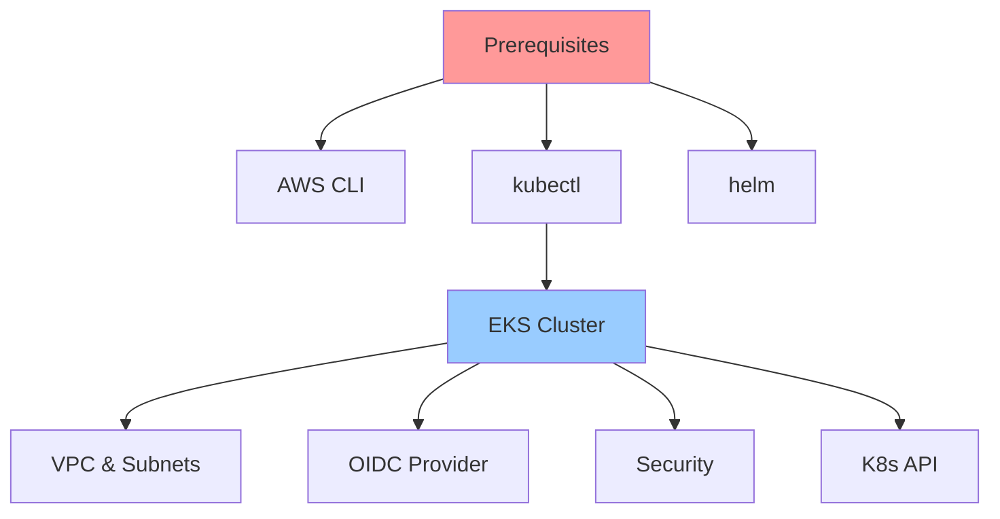

### Phase 1: Foundation Resources

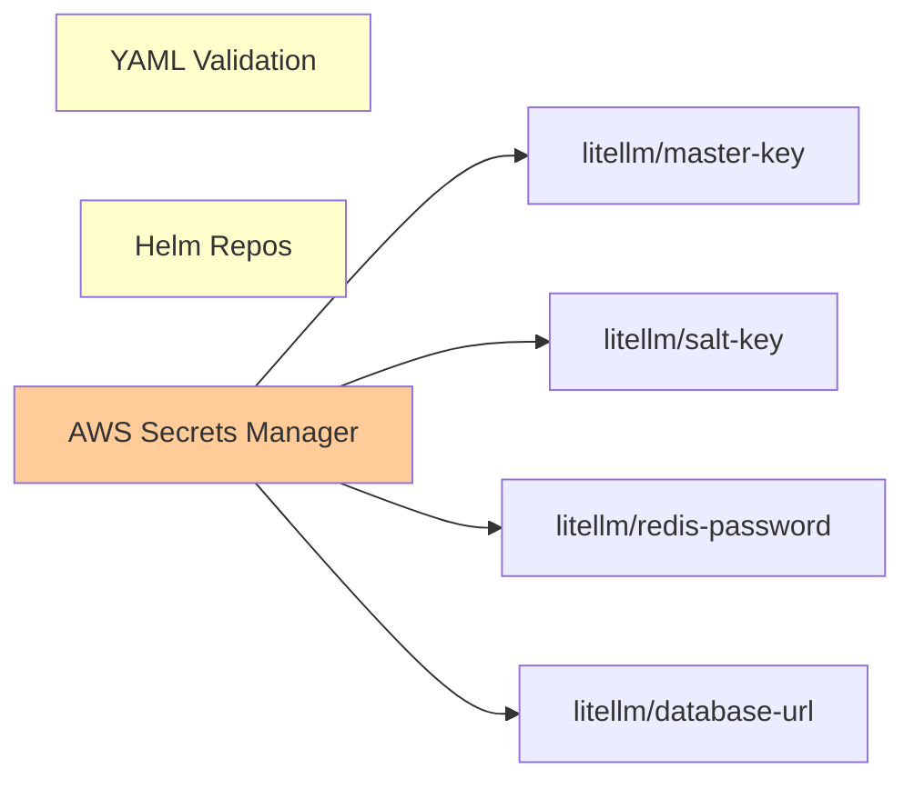

### Phase 2: IAM & Namespaces

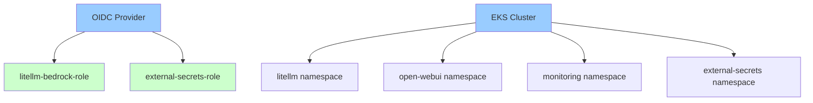

### Phase 3: External Secrets Operator

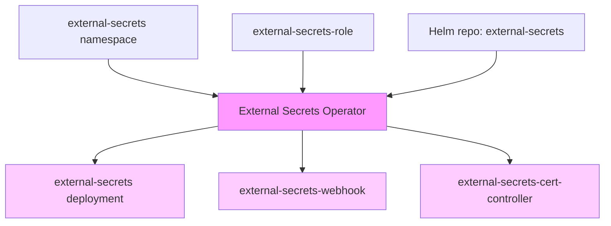

### Phase 4: Secret Stores & Secret Sync

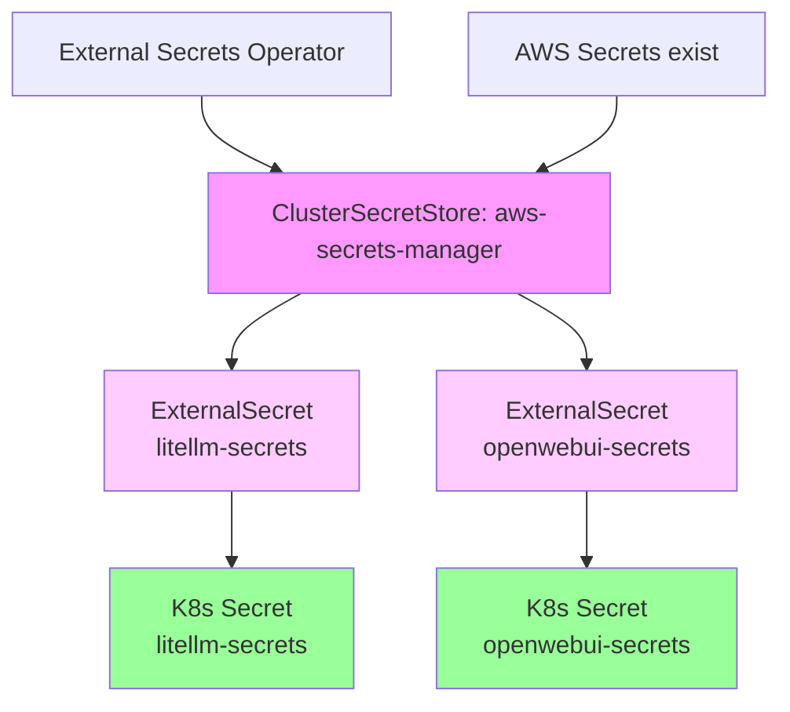

### Phase 5: Observability Stack

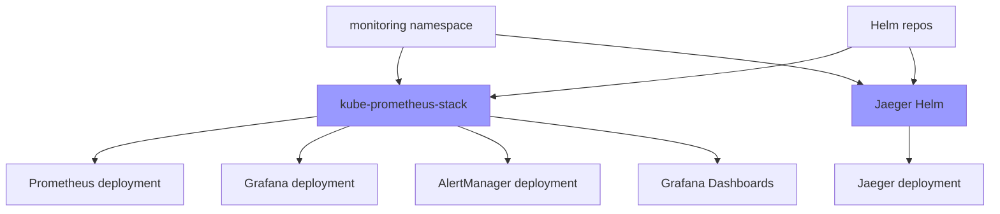

### Phase 6: Redis (Data Layer)

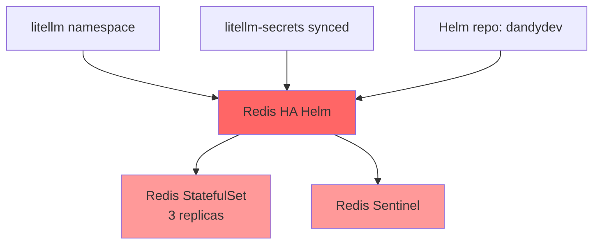

### Phase 7: LiteLLM (Application Layer)

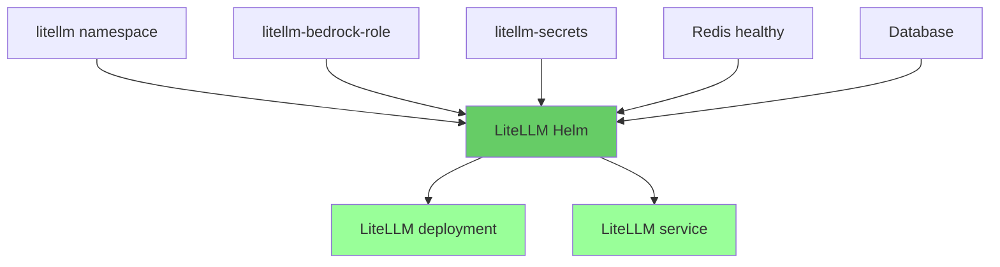

### Phase 8: OpenWebUI (Frontend Layer)

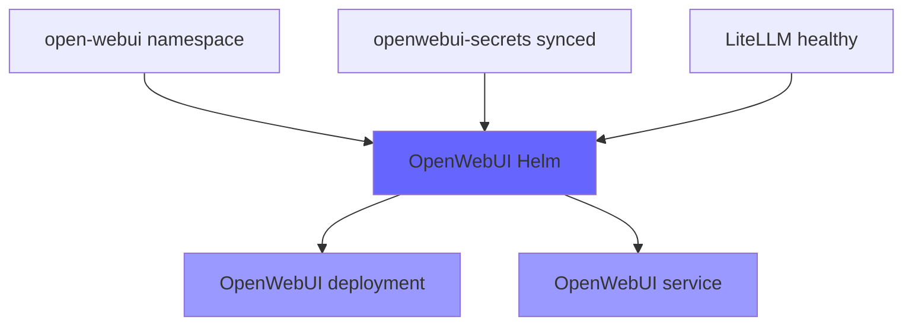

### Complete Deployment Flow

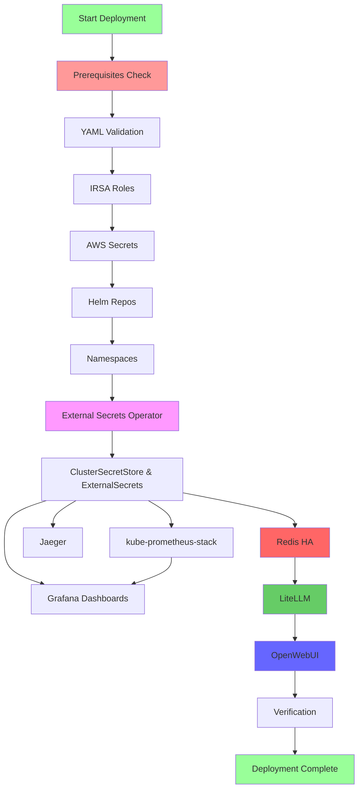

### Bastion Host Architecture

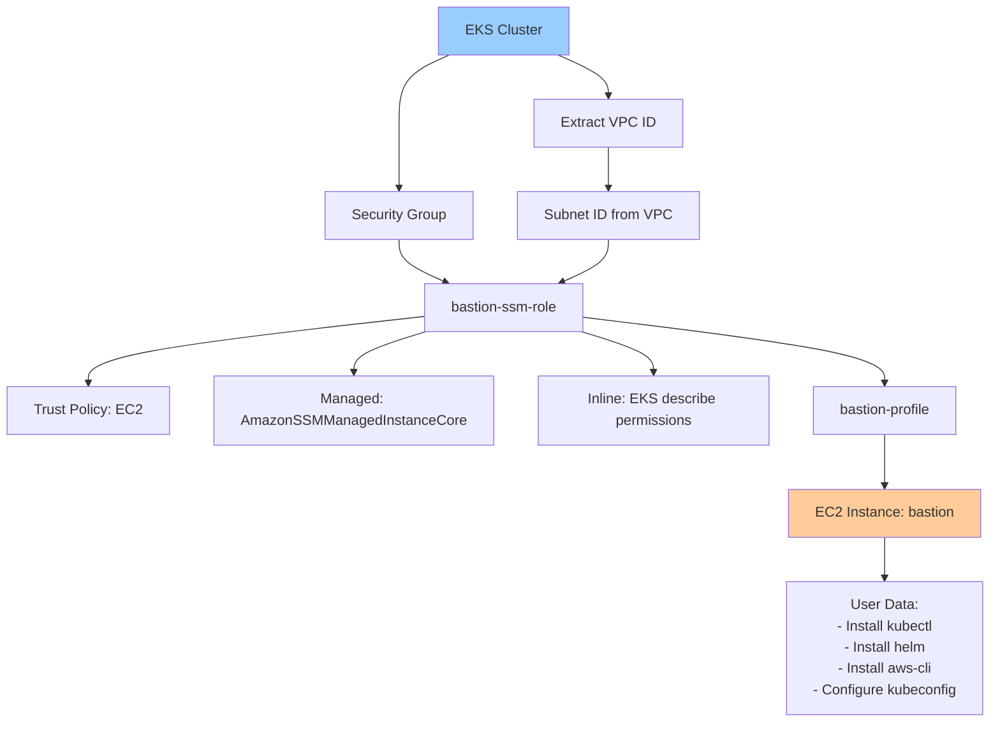

## Skip Validation Rules

### ✓ CAN SKIP if

- Resource exists AND is healthy
- No dependent resources being deployed
- User explicitly chooses to skip

### ✗ CANNOT SKIP if

- Resource doesn't exist
- Resource exists but is unhealthy (status != "deployed" for Helm)
- Dependent resource is being deployed in this session
- Resource is marked as critical dependency

### ⚠️ WARN BEFORE SKIP if

- Resource is critical (external-secrets, redis)
- Resource has dependents deployed

### 🛑 BLOCK PROCEED if

- Regenerating `litellm/salt-key` (data corruption risk)

### ⚠️ DOUBLE CONFIRM before

- Regenerating `litellm/master-key` (breaks all API keys)
- Terminating existing bastion instance
- Changing `litellm/database-url` (different database)

## Deployment Order Summary

| Phase | Component | Can Skip? | Notes |
|-------|-----------|-----------|-------|
| 1 | Prerequisites Check | ❌ Never | Always first, never skip |
| 2 | YAML Validation | ⚠️ Not recommended | Fast failure, recommend always run |
| 3 | IRSA Roles | ✅ If exists & healthy | Can skip if exist & healthy |
| 4 | AWS Secrets | ⚠️ With warning | Can skip if exist, WARN on regenerate |
| 5 | Helm Repos | ✅ Yes | Can skip, idempotent |
| 6 | Namespaces | ✅ If exists | Can skip if exist |
| 7 | External Secrets Operator | ⚠️ Critical | Can skip if healthy, CRITICAL dependency |
| 8 | ClusterSecretStore & ExternalSecrets | ✅ If synced | Can skip if secrets synced |
| 9 | kube-prometheus-stack | ✅ If healthy | Can skip if healthy, independent |
| 10 | Grafana Dashboards | ✅ Yes | Can skip, requires prometheus |
| 11 | Jaeger | ✅ If healthy | Can skip if healthy, independent |
| 12 | Redis HA | ⚠️ Critical | Can skip if healthy, CRITICAL for LiteLLM |
| 13 | LiteLLM | ⚠️ Critical | Can skip if healthy, CRITICAL for OpenWebUI |
| 14 | OpenWebUI | ✅ If healthy | Can skip if healthy, depends on LiteLLM |
| 15 | Verification | ⚠️ Recommended | Always last, recommended |

## Critical Dependencies

### Cannot Skip If

- **Resource doesn't exist**
- **Resource is unhealthy** (status != "deployed" for Helm)
- **Dependent resources are being deployed**
- **Resource is marked as CRITICAL**

### Critical Resources

1. **External Secrets Operator** - Required for secret synchronization
2. **Redis HA** - Required for LiteLLM (caching, rate limiting)
3. **LiteLLM** - Required for OpenWebUI (AI gateway)

### Secrets Safety

| Secret | Regeneration Risk | Behavior |
|--------|-------------------|----------|
| `litellm/master-key` | **HIGH** - Breaks all API keys | Double confirmation required |
| `litellm/salt-key` | **CRITICAL** - Corrupts database | **BLOCKED** - Cannot regenerate |
| `litellm/redis-password` | Low - Requires Redis restart | Confirmation required |
| `litellm/database-url` | **HIGH** - Changes database | Double confirmation required |

## Critical Dependency Paths

These diagrams show the critical paths that must be followed for successful deployment.

### Path 1 - Secrets Flow

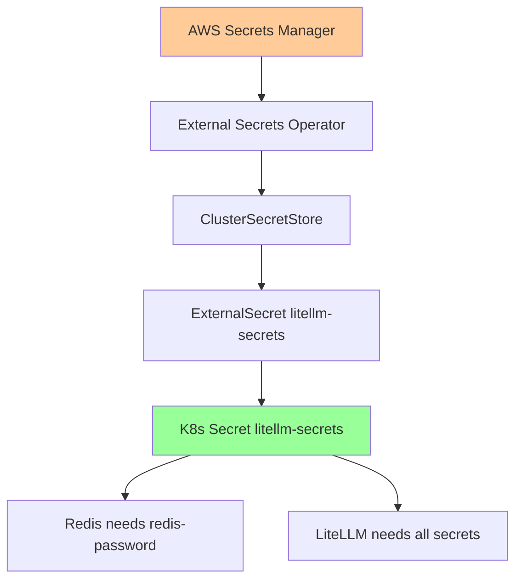

### Path 2 - LiteLLM Deployment Flow

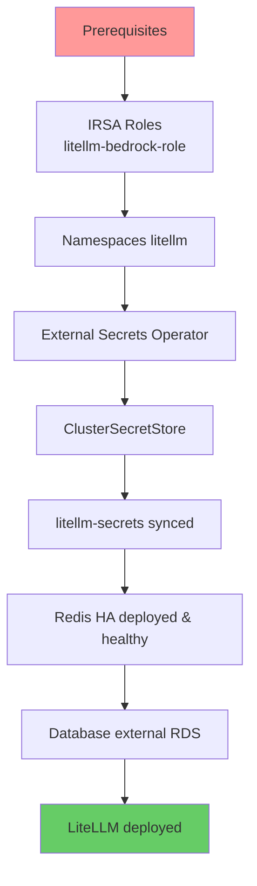

### Path 3 - OpenWebUI Full Stack

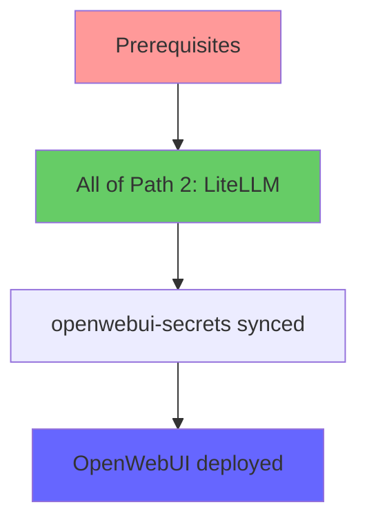

## Accessing Services

### From Bastion (Recommended)

1. Create bastion (if not created via Terraform):
   ```bash
   ./setup-bastion.sh create
   ```

2. Connect via SSM:
   ```bash
   ./setup-bastion.sh connect
   ```

3. Use pre-configured aliases:
   ```bash
   llm-ui         # OpenWebUI → http://localhost:8080
   llm-grafana    # Grafana → http://localhost:3000
   llm-prometheus # Prometheus → http://localhost:9090
   ```

### From Local Machine

If you have kubectl configured locally:

```bash
# OpenWebUI
kubectl port-forward svc/open-webui 8080:80 -n open-webui --address 0.0.0.0

# Grafana (default: admin / prom-operator)
kubectl port-forward svc/kube-prometheus-grafana 3000:80 -n monitoring --address 0.0.0.0

# Prometheus
kubectl port-forward svc/kube-prometheus-kube-prome-prometheus 9090:9090 -n monitoring --address 0.0.0.0

# Jaeger
kubectl port-forward svc/jaeger-query 16686:16686 -n monitoring --address 0.0.0.0
```

## Infrastructure Verification

Before deploying applications, you can verify that all required infrastructure components exist:

```bash
./deploy.sh infrastructure-verify
```

This command checks:

- **EKS Cluster** - Existence, status, version, endpoint
- **VPC** - VPC ID, subnet count
- **OIDC Provider** - Required for IRSA
- **IAM Roles** - litellm-bedrock-role, external-secrets-role
- **AWS Secrets** - master-key, salt-key, redis-password, database-url
- **RDS Database** - Connection endpoint
- **kubectl** - Connection to cluster

### Example Output

```text
━━━━━━━━━━━━━━━━━━━━━━━━━━━━━━━━━━━━━━━━━━━━━━━━━━━━━
EKS Cluster:
━━━━━━━━━━━━━━━━━━━━━━━━━━━━━━━━━━━━━━━━━━━━━━━━━━━━━
✓ EKS Cluster 'litellm-eks' exists
  Status: ACTIVE
  Version: 1.31
  Endpoint: https://XXXXX.gr7.us-east-1.eks.amazonaws.com

━━━━━━━━━━━━━━━━━━━━━━━━━━━━━━━━━━━━━━━━━━━━━━━━━━━━━
Summary:
━━━━━━━━━━━━━━━━━━━━━━━━━━━━━━━━━━━━━━━━━━━━━━━━━━━━━
✓ All infrastructure components verified
```

If components are missing, the script will offer to deploy them automatically.

## Listing Components

View all available deployment components:

```bash
./deploy.sh list
```

This shows:

- **Infrastructure components** (deployed via Terraform)
- **Application components** (deployed via Kubernetes)
- **Deployment modes** (complete, all, selective)
- **Verification commands**

Useful for understanding what can be deployed selectively.

## Troubleshooting

### kubectl Not Connected

```bash
# Configure kubectl
aws eks update-kubeconfig --name <cluster-name> --region <region>

# Verify connection
kubectl cluster-info
```

### Terraform Issues

```bash
# Reinitialize Terraform
cd ../terraform
rm -rf .terraform
terraform init

# Check state
terraform state list

# Validate configuration
terraform validate
```

### Helm Release Failures

```bash
# Check release status
helm list -A

# View release history
helm history <release-name> -n <namespace>

# Rollback if needed
helm rollback <release-name> -n <namespace>

# Delete and redeploy
helm uninstall <release-name> -n <namespace>
./deploy.sh <component>
```

### Secret Synchronization Issues

```bash
# Check External Secrets Operator
kubectl get pods -n external-secrets

# Check ClusterSecretStore
kubectl get clustersecretstore
kubectl describe clustersecretstore aws-secrets-manager

# Check ExternalSecret status
kubectl get externalsecret -A
kubectl describe externalsecret litellm-secrets -n litellm

# Check if K8s secret was created
kubectl get secret litellm-secrets -n litellm
kubectl describe secret litellm-secrets -n litellm
```

### Pod Issues

```bash
# Check pod status
kubectl get pods -A

# View pod logs
kubectl logs <pod-name> -n <namespace>

# Describe pod for events
kubectl describe pod <pod-name> -n <namespace>

# Check resource usage
kubectl top pods -A
```

### OPA Policy Violations

```bash
# View all constraints
kubectl get constraints

# View violations for a specific constraint
kubectl describe k8sallowedrepos allowed-image-repos

# View all violations
kubectl get constraints -o json | jq -r '.items[] | select(.status.totalViolations > 0) | "\(.metadata.name): \(.status.totalViolations) violations"'
```

## Cleanup

### Remove Applications (Keep Infrastructure)

```bash
# Uninstall Helm releases
helm uninstall open-webui -n open-webui
helm uninstall litellm -n litellm
helm uninstall redis -n litellm
helm uninstall kube-prometheus -n monitoring
helm uninstall jaeger -n monitoring
helm uninstall gatekeeper -n gatekeeper-system
helm uninstall external-secrets -n external-secrets

# Delete namespaces (this will clean up resources)
kubectl delete namespace litellm open-webui monitoring external-secrets gatekeeper-system
```

### Remove Everything (Infrastructure + Applications)

```bash
# WARNING: This deletes EVERYTHING including data
./deploy.sh infrastructure-destroy
```

### Remove Bastion Only

```bash
./setup-bastion.sh cleanup
```

## CI/CD Integration

### GitHub Actions Example

```yaml
name: Deploy LiteLLM

on:
  push:
    branches: [main]

jobs:
  deploy:
    runs-on: ubuntu-latest
    steps:
      - uses: actions/checkout@v4

      - name: Configure AWS Credentials
        uses: aws-actions/configure-aws-credentials@v4
        with:
          aws-access-key-id: ${{ secrets.AWS_ACCESS_KEY_ID }}
          aws-secret-access-key: ${{ secrets.AWS_SECRET_ACCESS_KEY }}
          aws-region: us-east-1

      - name: Deploy Infrastructure
        run: |
          cd scripts
          INTERACTIVE_MODE=false ./deploy.sh infrastructure

      - name: Deploy Applications
        run: |
          cd scripts
          INTERACTIVE_MODE=false AUTO_SKIP_HEALTHY=true ./deploy.sh all
```

### GitLab CI Example

```yaml
deploy:
  stage: deploy
  image: hashicorp/terraform:latest
  before_script:
    - apk add --no-cache aws-cli kubectl helm
  script:
    - cd scripts
    - INTERACTIVE_MODE=false ./deploy.sh complete
  only:
    - main
```

## Advanced Usage

### Selective Component Deployment

Deploy only what you need:

```bash
# Deploy only monitoring stack
./deploy.sh monitoring
./deploy.sh jaeger

# Deploy only application layer (assumes dependencies exist)
./deploy.sh redis
./deploy.sh litellm
./deploy.sh openwebui
```

### Update Existing Deployments

```bash
# Update LiteLLM to new version
./deploy.sh litellm

# Update monitoring stack
./deploy.sh monitoring
```

### Scaling

```bash
# Scale LiteLLM pods
kubectl scale deployment litellm -n litellm --replicas=5

# Scale Redis replicas (StatefulSet)
kubectl scale statefulset redis-redis-ha-server -n litellm --replicas=5
```

## Security Best Practices

1. **Use AWS Secrets Manager** for all secrets (enforced by External Secrets Operator)
2. **Enable IRSA** for pod authentication (no static credentials)
3. **Use IMDSv2** on EC2 instances (enforced in bastion script)
4. **Enable VPC Flow Logs** (configured in Terraform)
5. **Use private subnets** for workloads (configured in Terraform)
6. **Enable RDS encryption** (configured in Terraform)
7. **Use OPA Gatekeeper** for policy enforcement (deployed by script)
8. **Never commit secrets** to version control

## Performance Tuning

### Node Sizing

Edit `terraform/terraform.tfvars`:

```hcl
eks_node_groups = {
  default = {
    instance_types = ["m6i.xlarge", "m5.xlarge"]  # Increase size
    desired_size   = 5                             # More nodes
    max_size       = 10                            # Higher ceiling
  }
}
```

### Redis Tuning

Edit `helm-values/redis-values.yaml`:

```yaml
replicas: 5  # More Redis replicas
resources:
  requests:
    memory: 2Gi
    cpu: 1000m
```

### LiteLLM Tuning

Edit `helm-values/litellm-values.yaml`:

```yaml
replicaCount: 5  # More LiteLLM pods
resources:
  requests:
    memory: 2Gi
    cpu: 1000m
```

## Cost Optimization

For non-production environments, edit `terraform/terraform.tfvars`:

```hcl
# Use single NAT gateway
single_nat_gateway = true

# Disable Multi-AZ RDS
rds_multi_az = false

# Use smaller instances
rds_instance_class = "db.t3.small"
eks_node_groups = {
  default = {
    instance_types = ["t3.medium"]
    capacity_type  = "SPOT"  # Use spot instances
    desired_size   = 2
  }
}

# Don't create bastion (use setup-bastion.sh when needed)
create_bastion = false
```

## Support

- **Issues**: Report bugs or request features via GitHub Issues
- **Documentation**: See `../terraform/README.md` for infrastructure details
- **Dependencies**: See `Dependencies.md` for detailed dependency diagrams

## License

See repository LICENSE file.
