# Architecture Documentation: LiteLLM EKS Deployment

## Overview

This document provides comprehensive architectural documentation for the LiteLLM EKS deployment, including system design, component interactions, data flows, and security architecture.

**Last Updated:** 2025-12-05
**Version:** 1.0
**Environment:** AWS EKS (Kubernetes)

---

## Table of Contents

1. [System Architecture Overview](#system-architecture-overview)
2. [Component Architecture](#component-architecture)
3. [Network Architecture](#network-architecture)
4. [Security Architecture](#security-architecture)
5. [Data Flow Diagrams](#data-flow-diagrams)
6. [Deployment Architecture](#deployment-architecture)
7. [High Availability & Resilience](#high-availability--resilience)
8. [Observability Architecture](#observability-architecture)

---

## System Architecture Overview

### High-Level Architecture


### Key Characteristics

- **Architecture Pattern:** Microservices on Kubernetes
- **Deployment Model:** Multi-namespace, single-cluster
- **Security Model:** Defense in depth with IRSA, secrets management, network isolation
- **Availability Model:** High availability with replica sets, anti-affinity, PDBs
- **Observability Model:** Full-stack monitoring with metrics, logs, and traces

---

## Component Architecture

### Application Layer

#### OpenWebUI (Frontend)


#### LiteLLM Proxy (API Gateway)


**Model Configuration (7 Models):**
1. Claude 3.5 Sonnet v2 (8192 tokens)
2. Claude 3 Sonnet (4096 tokens)
3. Claude 3 Haiku (4096 tokens)
4. Claude 3 Opus (4096 tokens)
5. Llama 3.1 70B (2048 tokens)
6. Llama 3.1 8B (2048 tokens)
7. Mistral Large (4096 tokens)

### Data Layer

#### Redis HA Cluster


#### Amazon RDS PostgreSQL


### Observability Layer

#### Prometheus Stack


**Metrics Collected:**
- **LiteLLM:** Requests, latency, tokens, spend, errors, model health
- **Redis:** Connections, memory, hit rate, latency, replication lag
- **Kubernetes:** Pod status, resource usage, node health, volume capacity
- **Infrastructure:** CPU, memory, disk I/O, network throughput

#### Jaeger (Distributed Tracing)


#### Grafana (Visualization)


### Secrets Management

#### External Secrets Operator (ESO)

```mermaid
graph TD
    ASM[AWS Secrets Manager<br/>Source of Truth]
    ASM -->|litellm/database-url| ASM
    ASM -->|litellm/master-key| ASM
    ASM -->|litellm/salt-key<br/>IMMUTABLE!| ASM
    ASM -->|litellm/redis-password| ASM

    ASM -->|IRSA Auth<br/>external-secrets-role| CSS[ClusterSecretStore]

    CSS -->|Refresh every 1h<br/>JWT Auth| ES1[ExternalSecret:<br/>litellm-secrets]
    CSS -->|Refresh every 1h<br/>JWT Auth| ES2[ExternalSecret:<br/>redis-credentials]
    CSS -->|Refresh every 1h<br/>JWT Auth| ES3[ExternalSecret:<br/>openwebui-secrets]

    ES1 -->|Creates/Updates| K8S1[K8s Secret<br/>litellm namespace]
    ES2 -->|Creates/Updates| K8S2[K8s Secret<br/>litellm namespace]
    ES3 -->|Creates/Updates| K8S3[K8s Secret<br/>open-webui namespace]

    K8S1 -->|Mounted as<br/>env vars| LiteLLM[LiteLLM Pods]
    K8S2 -->|Mounted as<br/>env vars| Redis[Redis Pods]
    K8S3 -->|Mounted as<br/>env vars| OpenWebUI[OpenWebUI Pods]

    style ASM fill:#fff4d4
    style CSS fill:#d4e8f1
    style ES1 fill:#d4e8f1
    style ES2 fill:#d4e8f1
    style ES3 fill:#d4e8f1
    style K8S1 fill:#ffd4d4
    style K8S2 fill:#ffd4d4
    style K8S3 fill:#ffd4d4
    style LiteLLM fill:#d4f1d4
    style Redis fill:#ffd4d4
    style OpenWebUI fill:#d4f1d4
```



---

## Network Architecture

### Service Mesh & Communication


### Network Security Zones


**Recommended Network Policies** (not yet implemented):
```yaml
# Example: Allow only LiteLLM → Redis
apiVersion: networking.k8s.io/v1
kind: NetworkPolicy
metadata:
  name: redis-ingress
  namespace: litellm
spec:
  podSelector:
    matchLabels:
      app: redis
  policyTypes:
  - Ingress
  ingress:
  - from:
    - podSelector:
        matchLabels:
          app: litellm-proxy
    ports:
    - protocol: TCP
      port: 6379
```

---

## Security Architecture

### Authentication & Authorization Flow


### IAM Roles for Service Accounts (IRSA)


### Secrets Management Architecture


### Security Controls Matrix

| Control Type | Implementation | Status |
|--------------|----------------|--------|
| **Authentication** | Master key (LiteLLM), IRSA (AWS), Session auth (OpenWebUI) | ✅ Implemented |
| **Authorization** | Kubernetes RBAC, IAM policies, API key validation | ✅ Implemented |
| **Encryption (Transit)** | TLS for Bedrock API, RDS SSL recommended | ⚠️ Partial |
| **Encryption (Rest)** | EBS encryption, RDS encryption recommended, etcd encryption | ⚠️ Partial |
| **Network Isolation** | ClusterIP services, no public ingress | ✅ Implemented |
| **Network Segmentation** | Namespace separation, NetworkPolicy (TODO) | ⚠️ Partial |
| **Secrets Management** | AWS Secrets Manager + ESO, no hardcoded secrets | ✅ Implemented |
| **Least Privilege** | IRSA scoped permissions, non-root containers | ✅ Implemented |
| **Audit Logging** | Prometheus metrics, Jaeger traces, K8s audit logs (TODO) | ⚠️ Partial |
| **High Availability** | Multi-replica, anti-affinity, PDBs, health checks | ✅ Implemented |
| **Resource Limits** | CPU/memory limits on all pods | ✅ Implemented |
| **Image Security** | Pinned versions, official charts, Dependabot updates | ✅ Implemented |
| **Pod Security** | Non-root users (partial), PSS enforcement (TODO) | ⚠️ Partial |
| **Service Mesh/mTLS** | Not implemented (planned enhancement) | ❌ Not Implemented |

---

## Data Flow Diagrams

### Request Flow (Happy Path)


### Observability Data Flow


---

## Deployment Architecture

### Deployment Workflow


### Namespace Architecture

```
┌────────────────────────────────────────────────────────────────┐
│                     EKS Cluster Namespaces                      │
│                                                                 │
│  ┌──────────────────────────────────────────────────────────┐  │
│  │  open-webui                                              │  │
│  │  ├── Deployment: openwebui (1 replica)                  │  │
│  │  ├── Service: ClusterIP (port 80)                       │  │
│  │  ├── PVC: 10Gi gp3 (SQLite database)                    │  │
│  │  └── Secret: openwebui-secrets (synced from ESO)        │  │
│  └──────────────────────────────────────────────────────────┘  │
│                                                                 │
│  ┌──────────────────────────────────────────────────────────┐  │
│  │  litellm                                                 │  │
│  │  ├── Deployment: litellm-proxy (2 replicas)             │  │
│  │  ├── Service: ClusterIP (port 4000)                     │  │
│  │  ├── ServiceAccount: litellm-sa (IRSA annotated)        │  │
│  │  ├── PodDisruptionBudget: minAvailable=1                │  │
│  │  ├── Secret: litellm-secrets (ESO synced)               │  │
│  │  ├── Secret: redis-credentials (ESO synced)             │  │
│  │  ├── StatefulSet: redis-ha (3 replicas)                 │  │
│  │  ├── Service: redis-ha (ClusterIP port 6379)            │  │
│  │  ├── Service: redis-ha-announce-* (headless)            │  │
│  │  ├── PVC: redis-data-* (8Gi gp3 × 3)                    │  │
│  │  └── PodDisruptionBudget: redis-ha maxUnavailable=1     │  │
│  └──────────────────────────────────────────────────────────┘  │
│                                                                 │
│  ┌──────────────────────────────────────────────────────────┐  │
│  │  monitoring                                              │  │
│  │  ├── StatefulSet: prometheus (1 replica)                │  │
│  │  ├── PVC: prometheus-data (50Gi gp3)                    │  │
│  │  ├── Deployment: grafana (1 replica)                    │  │
│  │  ├── PVC: grafana-storage (10Gi gp3)                    │  │
│  │  ├── StatefulSet: alertmanager (1 replica)              │  │
│  │  ├── PVC: alertmanager-data (5Gi gp3)                   │  │
│  │  ├── Deployment: jaeger (1 replica)                     │  │
│  │  ├── Service: jaeger-collector (ClusterIP)              │  │
│  │  ├── Service: jaeger-query (ClusterIP port 16686)       │  │
│  │  ├── DaemonSet: node-exporter (all nodes)               │  │
│  │  ├── Deployment: kube-state-metrics                     │  │
│  │  └── ServiceMonitor: litellm-proxy, redis-exporter      │  │
│  └──────────────────────────────────────────────────────────┘  │
│                                                                 │
│  ┌──────────────────────────────────────────────────────────┐  │
│  │  external-secrets                                        │  │
│  │  ├── Deployment: external-secrets (1 replica)           │  │
│  │  ├── Deployment: external-secrets-webhook               │  │
│  │  ├── Deployment: external-secrets-cert-controller       │  │
│  │  ├── ServiceAccount: external-secrets (IRSA)            │  │
│  │  ├── ClusterSecretStore: aws-secretsmanager             │  │
│  │  ├── ExternalSecret: litellm-secrets → litellm ns       │  │
│  │  ├── ExternalSecret: redis-credentials → litellm ns     │  │
│  │  └── ExternalSecret: openwebui-secrets → open-webui ns  │  │
│  └──────────────────────────────────────────────────────────┘  │
└─────────────────────────────────────────────────────────────────┘
```

---

## High Availability & Resilience

### Failure Scenarios & Mitigations

| Scenario | Impact | Mitigation | Recovery Time |
|----------|--------|------------|---------------|
| **Single LiteLLM pod crash** | 50% capacity reduction | 2 replicas with anti-affinity, PDB minAvailable=1 | <30s (readiness probe) |
| **Redis master failure** | Temporary cache unavailability | Sentinel auto-failover to replica, quorum=2 | <5s (failover) |
| **Redis complete outage** | No caching, rate limiting degraded | LiteLLM should handle gracefully (fallback to direct Bedrock calls) | Service-dependent |
| **PostgreSQL connection loss** | API key validation fails | RDS Multi-AZ recommended, connection retry logic | 60-120s (RDS failover) |
| **Bedrock API throttling** | Request failures | Exponential backoff, multi-model fallback (LiteLLM feature) | Variable |
| **Prometheus pod restart** | 15-min metrics gap | Persistent volume preserves historical data | 30-60s (pod restart) |
| **Jaeger pod restart** | Loss of in-memory traces | Recommendation: Use persistent backend (Elasticsearch) | 30-60s (no data recovery) |
| **EKS node failure** | Pods reschedule to other nodes | Multi-replica, pod anti-affinity, cluster autoscaler | 1-3 min (reschedule) |
| **AZ outage** | Depends on node distribution | Multi-AZ node groups recommended | Variable |
| **Secrets sync failure** | Pods use last-synced secrets | ESO retry logic, 1h refresh interval | 1h max (next sync) |

### Health Check Configuration

```yaml
# LiteLLM Health Checks
livenessProbe:
  httpGet:
    path: /health/liveliness
    port: 4000
  initialDelaySeconds: 30
  periodSeconds: 10
  failureThreshold: 3

readinessProbe:
  httpGet:
    path: /health/readiness
    port: 4000
  initialDelaySeconds: 10
  periodSeconds: 5
  failureThreshold: 3

# Redis Health Checks
livenessProbe:
  exec:
    command:
      - redis-cli
      - ping
  periodSeconds: 10

readinessProbe:
  exec:
    command:
      - redis-cli
      - ping
  periodSeconds: 5
```

### Resource Quotas & Limits

```yaml
# Example resource configuration
resources:
  requests:
    cpu: 500m      # Guaranteed CPU
    memory: 1Gi    # Guaranteed memory
  limits:
    cpu: 2000m     # Max CPU (throttled if exceeded)
    memory: 4Gi    # Max memory (OOMKilled if exceeded)
```

**Recommendations:**
- Set requests = limits for guaranteed QoS (critical services)
- Monitor resource usage with Prometheus and adjust limits
- Implement HPA (Horizontal Pod Autoscaler) for LiteLLM based on CPU/request rate

---

## Observability Architecture

### Monitoring Strategy


### Key Metrics & Alerts

**LiteLLM Metrics:**
```promql
# Request rate by model
rate(litellm_proxy_total_requests_metric[5m])

# Error rate
rate(litellm_proxy_failed_requests_metric[5m]) / rate(litellm_proxy_total_requests_metric[5m])

# P95 latency
histogram_quantile(0.95, rate(litellm_request_total_latency_metric_bucket[5m]))

# Token spend rate (cost tracking)
rate(litellm_spend_metric[1h])

# Model health (0=healthy, 1=partial, 2=outage)
litellm_deployment_state
```

**Redis Metrics:**
```promql
# Cache hit rate
redis_keyspace_hits_total / (redis_keyspace_hits_total + redis_keyspace_misses_total)

# Memory usage
redis_memory_used_bytes / redis_memory_max_bytes

# Replication lag
redis_master_repl_offset - redis_slave_repl_offset
```

**Recommended Alerts:**
- LiteLLM error rate > 5% (5 min window)
- LiteLLM P95 latency > 10s
- Redis cache hit rate < 50%
- Redis memory usage > 90%
- Bedrock API spend > $X/hour
- Pod restart count > 3 (1 hour window)

---

## Appendix

### Technology Stack Summary

| Category | Technology | Version | Purpose |
|----------|-----------|---------|---------|
| **Orchestration** | Amazon EKS | 1.28+ | Kubernetes cluster management |
| **Container Runtime** | containerd | Latest | Container execution |
| **Package Manager** | Helm | 3.x | Application deployment |
| **Application** | LiteLLM | 1.80.5-stable | LLM API gateway |
| **Frontend** | OpenWebUI | 0.6.41 | Chat interface |
| **Caching** | Redis | 7.4.1-alpine | Distributed caching |
| **Database** | PostgreSQL | 15+ (RDS) | Relational data storage |
| **Metrics** | Prometheus | 2.x | Time-series metrics |
| **Visualization** | Grafana | 10.x | Dashboards |
| **Tracing** | Jaeger | 1.76.0 | Distributed tracing |
| **Secrets** | External Secrets Operator | 0.12.1 | Secrets management |
| **Storage** | AWS EBS gp3 | - | Persistent volumes |
| **AI Models** | AWS Bedrock | - | Foundation models (Claude, Llama, Mistral) |

### Port Reference

| Service | Port | Protocol | Purpose |
|---------|------|----------|---------|
| OpenWebUI | 80 | HTTP | Web interface |
| LiteLLM | 4000 | HTTP | API endpoint, /metrics |
| Redis | 6379 | TCP | Cache/session storage |
| PostgreSQL | 5432 | TCP | Database (RDS) |
| Prometheus | 9090 | HTTP | Metrics query |
| Grafana | 80 | HTTP | Dashboard UI |
| Alertmanager | 9093 | HTTP | Alert management |
| Jaeger Collector | 4317 | gRPC | OTLP ingestion |
| Jaeger Collector | 4318 | HTTP | OTLP ingestion |
| Jaeger Query | 16686 | HTTP | Trace UI |
| Redis Exporter | 9121 | HTTP | Redis metrics |
| Node Exporter | 9100 | HTTP | Host metrics |

### File Structure Reference

```
eks-deploy/
├── deploy.sh                    # Main deployment automation (699 lines)
├── scripts/
│   └── setup-bastion.sh        # Bastion provisioning (420 lines)
├── helm-values/
│   ├── external-secrets.yaml   # ESO configuration
│   ├── grafana-values.yaml     # Grafana settings
│   ├── jaeger-values.yaml      # Jaeger config
│   ├── litellm-values.yaml     # LiteLLM settings (model configs)
│   ├── openwebui-values.yaml   # OpenWebUI settings
│   ├── prometheus-values.yaml  # Prometheus stack config
│   ├── redis-values.yaml       # Redis HA config
│   └── values.yaml             # (Deprecated/unused)
├── manifests/
│   ├── clustersecretstore.yaml     # ESO secret store
│   ├── externalsecret-litellm.yaml # LiteLLM secrets sync
│   ├── externalsecret-redis.yaml   # Redis secrets sync
│   └── servicemonitor.yaml         # Prometheus scrape configs
├── iam/
│   ├── bedrock-policy.json         # Bedrock permissions
│   ├── external-secrets-policy.json # Secrets Manager permissions
│   └── trust-policy-template.json  # IRSA trust relationship
├── grafana_dashboards/
│   ├── litellm-dashboard.json      # LiteLLM metrics dashboard
│   └── litellm-model-health.json   # Model health dashboard
├── README.md                   # User documentation (470 lines)
└── .github/
    └── dependabot.yml          # Dependency updates config
```

---

## Document Maintenance

- **Review Frequency:** Quarterly or after major architecture changes
- **Owner:** Platform Engineering / DevOps Team
- **Last Updated:** 2025-12-05
- **Next Review:** 2026-03-05
- **Related Documents:** THREAT_MODEL.md, README.md

---

## Glossary

- **IRSA:** IAM Roles for Service Accounts - Pod-level AWS IAM authentication
- **ESO:** External Secrets Operator - Syncs secrets from AWS to Kubernetes
- **PDB:** PodDisruptionBudget - Controls voluntary pod evictions
- **PV/PVC:** PersistentVolume/PersistentVolumeClaim - Kubernetes storage abstraction
- **OTLP:** OpenTelemetry Protocol - Telemetry data transmission standard
- **ServiceMonitor:** Prometheus CRD for auto-discovering scrape targets
- **Sentinel:** Redis HA mechanism for automatic failover
- **ClusterIP:** Internal Kubernetes service (no external exposure)
- **Bedrock:** AWS managed service for foundation models
